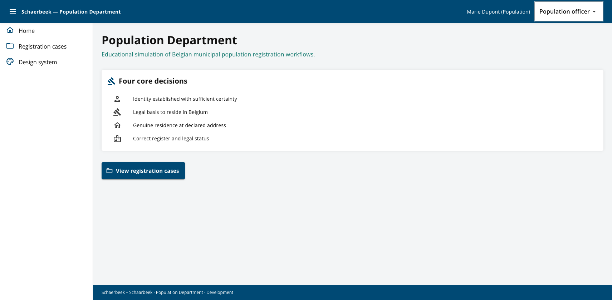
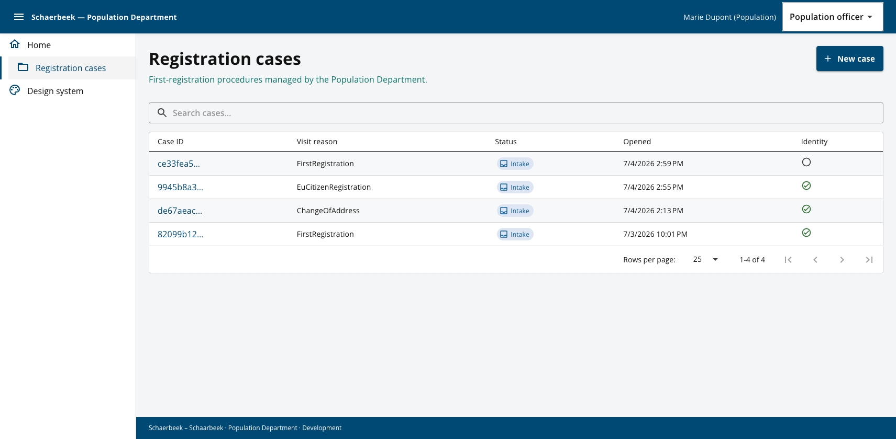
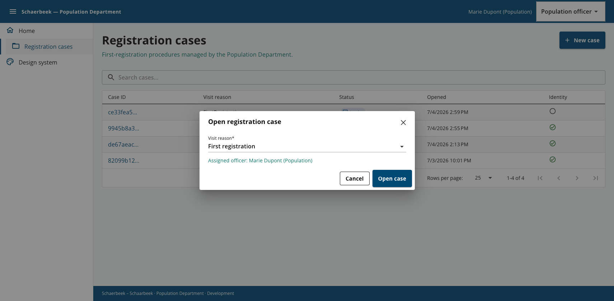
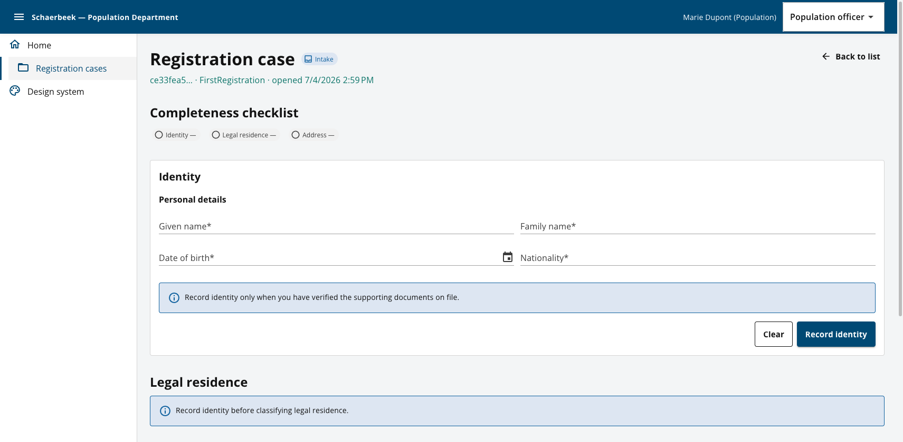
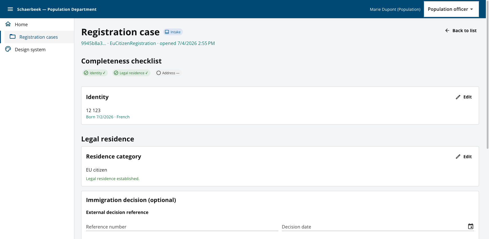
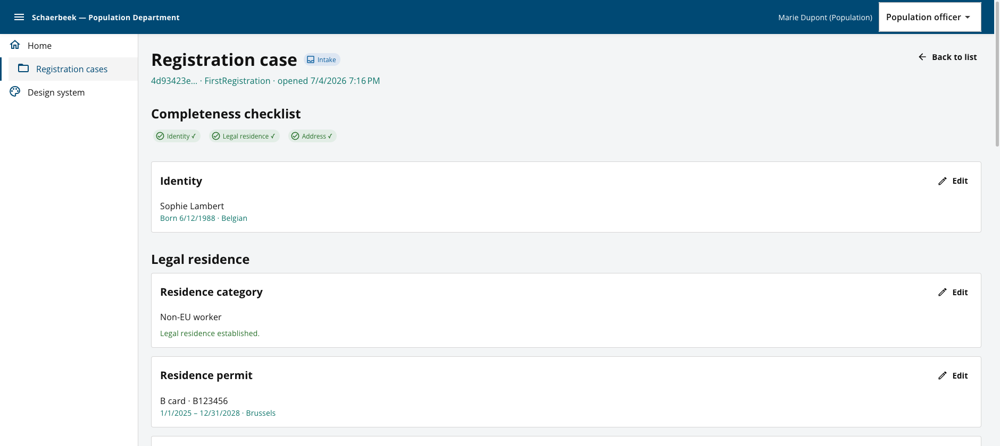
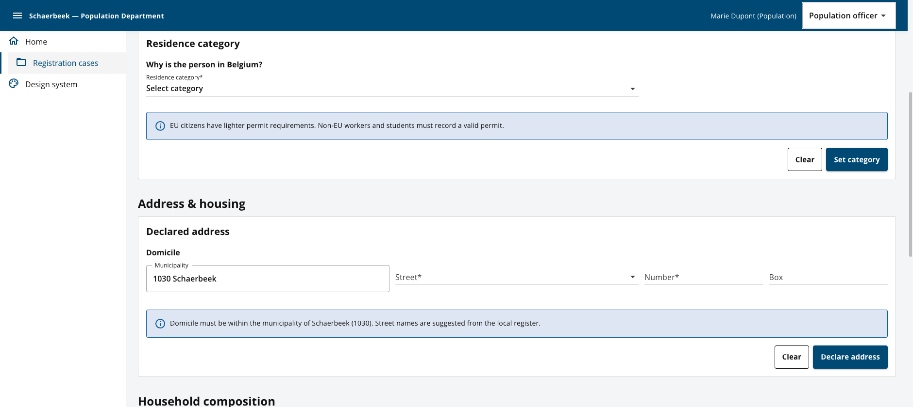
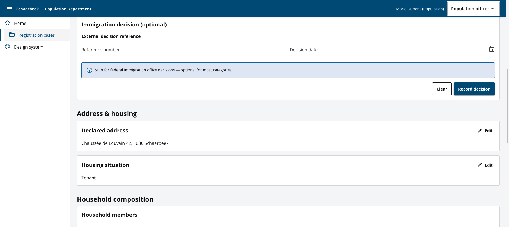
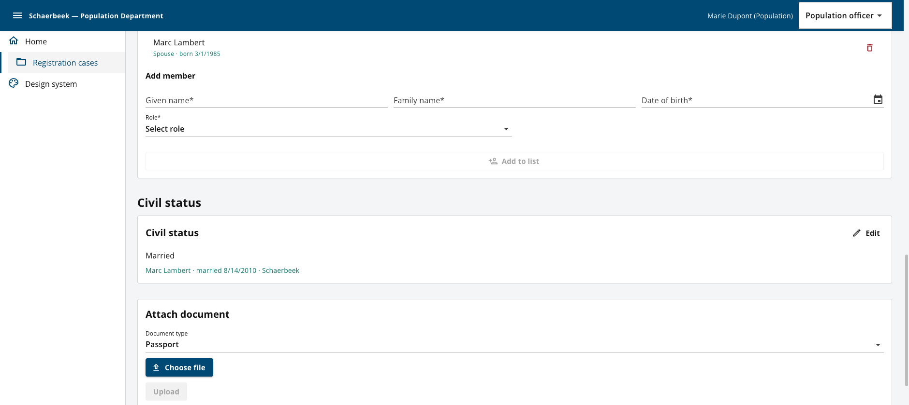
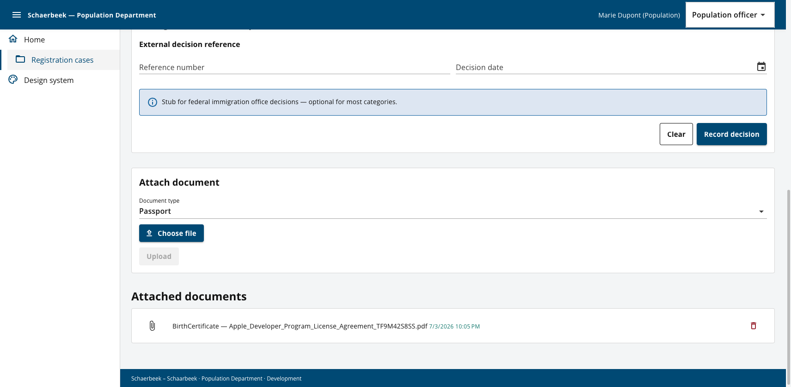

# Application overview

Visual tour of the Schaerbeek Population Department back-office as of **Phase 4** (address, household, civil status), on the Schaerbeek design system from **Phase 3**, with intake correction UI from **Phase 2.1**.

Run the app locally:

```bash
dotnet run --project src/SchaerbeekMunicipality.AppHost
```

Open the Web app from the Aspire dashboard (typically `http://localhost:5155`).

---

## Home dashboard

Landing page summarising the four core registration decisions from [IDEA.md](../IDEA.md).



---

## Registration case list

Officers browse open first-registration procedures. The table shows visit reason, intake status, opened date, and whether identity has been established. Search and pagination are built in.



**Capabilities:** `ListRegistrationCases`, case search, officer role switcher in the app bar.

---

## Open a new case

The **New case** button opens a dialog to choose a visit reason. The current officer is assigned automatically.



**Capabilities:** `OpenRegistrationCase` — visit reasons include first registration, EU citizen registration, and change of address.

---

## Record identity (intake step)

A freshly opened case starts on the identity step. The completeness checklist tracks progress across identity, legal residence, and address. Later steps stay visible; address and household require identity first.



**Capabilities:** `RecordIdentity` — given name, family name, date of birth, nationality; checklist flag `IdentityEstablished`.

---

## Legal residence — EU citizen

Once identity is saved, the legal residence section unlocks. EU citizens can be classified without a permit; the checklist marks legal residence as established when policy rules pass.



**Capabilities:** `SetResidenceCategory`, optional `RecordImmigrationDecision` stub, completeness checklist.

---

## Legal residence — non-EU worker with permit

Non-EU categories require a residence permit. Officers can attach supporting documents and review what is already on file.



**Capabilities:**

| Area | Use cases |
|------|-----------|
| Identity | `RecordIdentity`, `CorrectIdentity` (edit) |
| Residence | `SetResidenceCategory`, `RecordResidencePermit`, `RecordImmigrationDecision` (all editable after save) |
| Documents | `AttachDocument`, `RemoveDocument` |
| Policies | `EuCitizenPolicy`, `NonEuWorkerPolicy`, `StudentPolicy` — checklist `LegalResidenceEstablished` |

---

## Address declaration (1030 Schaerbeek)

First registration at this desk requires a domicile **within Schaerbeek**. The municipality is fixed to `1030 Schaerbeek`; officers pick a street from the local register, then enter number and box.



**Capabilities:** `DeclareAddress` — sets checklist `AddressDeclared`; `RecordHousingSituation` (tenant, owner, …). Both support edit after save.

---

## Address, household & civil status (complete case)

A fully progressed case shows declared domicile, housing situation, household members, and civil status with marriage details when applicable.





**Capabilities:**

| Area | Use cases |
|------|-----------|
| Address | `DeclareAddress`, `RecordHousingSituation` |
| Household | `RecordHouseholdComposition` — add/remove members (spouse, child, …) |
| Civil status | `RecordCivilStatus` — conditional marriage fields when married |
| Reference data | Schaerbeek street autocomplete (`GET /api/registration/streets?postalCode=1030`) |

---

## Document upload & attached files

Immigration decision stub, file upload by document type, and a list of attached documents with remove action.



---

## Navigation & shell

| Item | Route | Purpose |
|------|-------|---------|
| Home | `/home` | Dashboard and workflow overview |
| Registration cases | `/registration/cases` | Case list and detail wizard |
| Design system | `/design-system` | Schaerbeek UI kit showcase (Phase 3) |

The app bar shows a fake officer identity (**Marie Dupont**) and a role switcher for development (`PopulationOfficer`, etc.).

---

## What is not built yet

See [ROADMAP.md](./ROADMAP.md) for upcoming phases:

- **Phase 5** — National Register search and BIS duplicate detection
- **Phase 6** — Police verification loop
- **Phase 7+** — Final decision, registration, certificates
