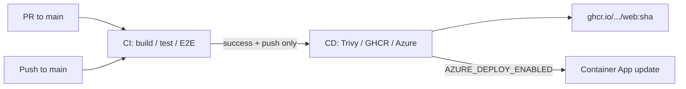

# Continuous Integration & Deploy

GitHub Actions splits **CI** (build/test) from **CD** (image + Azure). They are **separate workflow runs** in the Actions tab:

- **PRs** → CI only
- **Push to `main`** → CI runs; when it succeeds, CD starts automatically
- **Manual** → run CI or CD from the Actions tab (`workflow_dispatch`)

This project is intended as a **public repository**. GitHub provides **free Actions minutes** for public repos.

## Pipeline flow



CD is wired with `workflow_run` on the **CI** workflow. It only publishes when that CI run:

1. finished with **success**, and
2. was triggered by a **`push`** (not a PR, and not a manual CI re-run).

To republish/redeploy without a new commit, use **Actions → CD → Run workflow**.

## Workflows

| Workflow | File | When |
|----------|------|------|
| **CI** | [`.github/workflows/ci.yml`](../.github/workflows/ci.yml) | PR / push `main` / `workflow_dispatch` |
| **CD** | [`.github/workflows/cd.yml`](../.github/workflows/cd.yml) | After successful CI **push** on `main` / `workflow_dispatch` |
| **PostgreSQL migrations** | [`.github/workflows/ci-postgres.yml`](../.github/workflows/ci-postgres.yml) | Push `main` / `workflow_dispatch` (not a PR gate) |
| **CodeQL** | [`.github/workflows/codeql.yml`](../.github/workflows/codeql.yml) | PR / push `main` / weekly |

### CI jobs (`ci.yml`)

| Job | Purpose |
|-----|---------|
| **Build & test** | Restore (NuGet cache) → Release build → tests with `Category!=E2E&Category!=PostgreSQL` → upload Release `bin` artifacts |
| **E2E (Playwright)** | Download artifacts → cached Chromium → `Category=E2E` |

### CD jobs (`cd.yml`)

| Job | Purpose |
|-----|---------|
| **Build, scan & push image** | Checkout the CI commit → Docker Buildx + GHA cache → Trivy (HIGH/CRITICAL) → push `latest` + short SHA to GHCR |
| **Deploy to Azure** | After publish, when `AZURE_DEPLOY_ENABLED=true`: OIDC login → `az containerapp update` with SHA-tagged image |

Image references are **lowercase** (e.g. `ghcr.io/jobijoba/...`). Mixed-case GitHub owners are normalized in CD before Azure update.

Concurrent CI runs on the same branch are cancelled when a newer commit is pushed. CD uses a single `cd-main` concurrency group.

No Aspire workload step: since Aspire 9, hosting packages ship as NuGet packages, so `dotnet restore` builds `AppHost`.

## What the PR path does not run

| Not on PRs | Reason |
|------------|--------|
| PostgreSQL / Testcontainers | Kept on `ci-postgres.yml` for `main` only — filter excludes `Category=PostgreSQL` |
| Container publish / Azure deploy | CD only after green CI on a `main` **push** (or manual CD) |
| .NET Aspire AppHost | Local orchestration only |

See [TESTING.md](./TESTING.md) for the test strategy.

## Local parity

```bash
dotnet restore
dotnet build --configuration Release
dotnet test --configuration Release --verbosity normal --filter "Category!=E2E&Category!=PostgreSQL"
```

E2E (Playwright, slower):

```bash
dotnet test tests/SchaerbeekMunicipality.E2E.Tests --configuration Release --filter "Category=E2E"
```

See [tests/SchaerbeekMunicipality.E2E.Tests/README.md](../tests/SchaerbeekMunicipality.E2E.Tests/README.md) for browser install.

## Status badges

```markdown
[](https://github.com/JobiJoba/SchaerbeekMunicipality/actions/workflows/ci.yml)
[](https://github.com/JobiJoba/SchaerbeekMunicipality/actions/workflows/cd.yml)
```

## Branch protection (recommended)

1. **Settings → Branches → Add rule** for `main`
2. Require status checks: **Build & test** and **E2E (Playwright)** (from **CI** only)
3. Do **not** require CD jobs on PRs — CD does not run for pull requests
4. Require pull request before merging (optional but recommended)

## Security automation

| Mechanism | Location |
|-----------|----------|
| Dependabot (NuGet, Actions, Docker) | [`.github/dependabot.yml`](../.github/dependabot.yml) |
| NuGet advisory fail | `TreatWarningsAsErrors` — no blanket `NU190x` suppressions; transitive pins in [`Directory.Packages.props`](../Directory.Packages.props) |
| Trivy image scan | Publish job in `cd.yml` — fails on unfixed HIGH/CRITICAL |
| CodeQL (C#) | `codeql.yml` — `security-extended` queries |

## Public repository notes

| Topic | Guidance |
|-------|----------|
| **CI secrets** | Not required for build/test — tests use SQLite |
| **Azure CD secrets** | Optional — see [Continuous deploy](#continuous-deploy-azure-oidc) |
| **Fork PRs** | Secrets are not exposed to workflows from forks |
| **Credentials** | Never commit connection strings, API keys, or `.env` files |

## PostgreSQL migration job

SQLite tests use `EnsureCreated()` and **cannot validate** PostgreSQL migrations. [`ci-postgres.yml`](../.github/workflows/ci-postgres.yml) applies migrations against Testcontainers PostgreSQL (`Category=PostgreSQL`).

Runs on push to `main` and via `workflow_dispatch`. Keep this **off the critical PR path**.

## Continuous deploy (Azure OIDC)

The **CD** workflow runs after a successful **CI** **push** to `main`. After image push, the **Deploy to Azure** job updates the existing Container App to the **short SHA** tag (not `:latest`). It does **not** rewrite the README URL.

### One-time setup

1. Create an Azure AD app registration (or use `az ad app create`) and a service principal.
2. Add a **federated credential** for GitHub:
   - Issuer: `https://token.actions.githubusercontent.com`
   - Subject: `repo:JobiJoba/SchaerbeekMunicipality:ref:refs/heads/main`
   - Audience: `api://AzureADTokenExchange`
3. Grant the principal **Contributor** (or a tighter custom role) on resource group `schaerbeek-rg`.
4. In the GitHub repo **Settings → Secrets and variables → Actions**:
   - Secrets: `AZURE_CLIENT_ID`, `AZURE_TENANT_ID`, `AZURE_SUBSCRIPTION_ID`
   - Variable: `AZURE_DEPLOY_ENABLED` = `true`
   - Optional variables: `AZURE_RESOURCE_GROUP` (default `schaerbeek-rg`), `AZURE_CONTAINER_APP_NAME` (default `schaerbeek-web`)
5. Ensure the app already exists (first-time infra: run [`deploy/azure/sqlite/deploy.sh`](../deploy/azure/sqlite/deploy.sh) manually).

Until `AZURE_DEPLOY_ENABLED` is set, **CD still publishes** the image; only the Azure update is skipped.

Full Bicep / first-time deploy remains manual — see [deploy/azure/README.md](../deploy/azure/README.md). Postgres profile is not auto-deployed.

Optional `HEALTH_CHECK_API_KEY` remains available in app config but is **not** wired into Bicep probes (probe header wiring is easy to misconfigure for a demo).

## Troubleshooting

| Failure | Likely cause |
|---------|--------------|
| Test fails on CI but passes locally | Case-sensitive paths on Linux, or missing test isolation |
| Build fails on AppHost | Aspire package version mismatch — align `Aspire.Hosting.*` versions |
| CI green, CD never starts | CD only follows a successful CI **push** on `main`. A PR or **Actions → CI → Run workflow** does not start CD — use **Actions → CD → Run workflow**, or push to `main`. |
| Trivy fails publish | Fix or upgrade base/app packages; `ignore-unfixed` is enabled for HIGH/CRITICAL |
| Deploy skipped | `AZURE_DEPLOY_ENABLED` not `true`, or Azure OIDC secrets missing |
| Deploy fails auth (`AADSTS700213`) | Federated credential **subject** must be exactly `repo:JobiJoba/SchaerbeekMunicipality:ref:refs/heads/main` on the app whose client ID is `AZURE_CLIENT_ID`; principal also needs RBAC on the resource group |
| Image ref invalid / could not parse | Owner must be lowercase in the image name (`jobijoba`, not `JobiJoba`) — CD already lowercases this |

## Related documents

- [TESTING.md](./TESTING.md) — test layers and what runs in CI
- [TECH-STACK.md](./TECH-STACK.md) — stack and tooling
- [deploy/azure/README.md](../deploy/azure/README.md) — Bicep profiles and manual deploy
- [ROADMAP.md](./ROADMAP.md) — phased delivery
