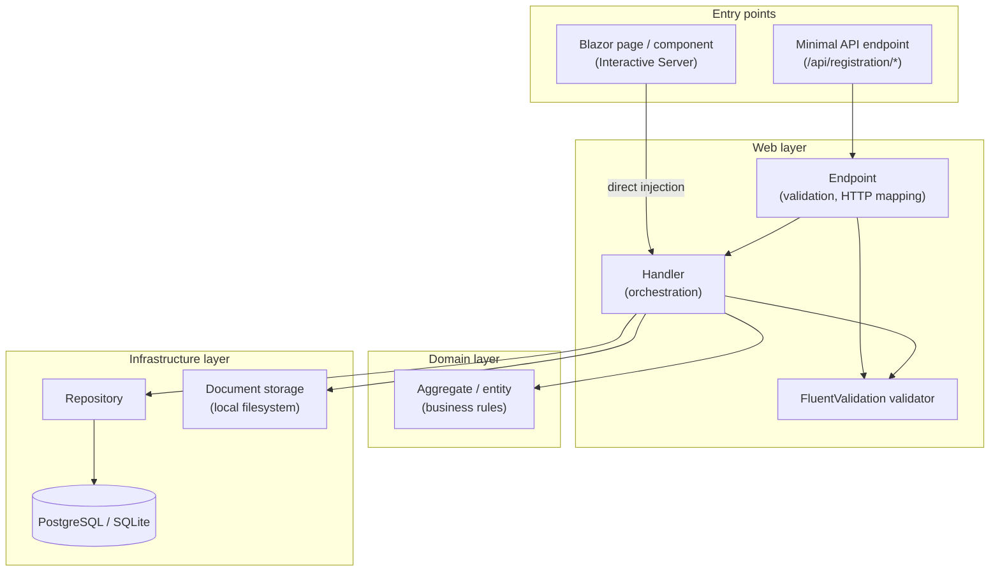
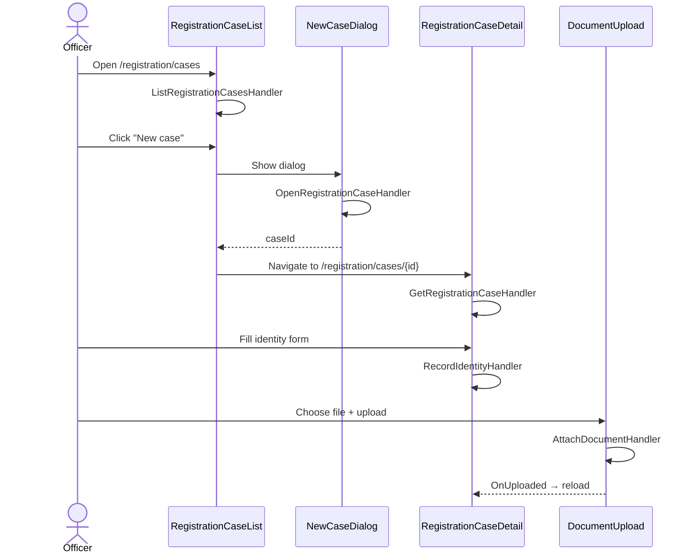

# Feature flow documentation

This folder documents how each vertical slice in the application works — from UI or HTTP entry point through handlers, domain logic, and persistence.

## Bounded contexts

| Context | Slices | Entry points |
|---------|--------|--------------|
| [Registration](./registration/README.md) | 18+ use cases | Blazor pages + `/api/registration/*` |

## Shared architecture

Every feature follows the same vertical-slice pattern described in [ARCHITECTURE.md](../ARCHITECTURE.md):

### Key conventions

- **Blazor Server** pages inject handlers directly (no HTTP round-trip).
- **Minimal API** endpoints validate input, map HTTP status codes, then delegate to the same handlers.
- **Handlers** are thin orchestrators: load aggregate → call domain method → persist → return DTO.
- **Domain** aggregates enforce state transitions and invariants; handlers never bypass them.

## Registration feature index

| Slice | Doc | HTTP route | Blazor entry |
|-------|-----|------------|--------------|
| List cases | [list-registration-cases.md](./registration/list-registration-cases.md) | `GET /api/registration/cases` | `RegistrationCaseList.razor` |
| Open case | [open-registration-case.md](./registration/open-registration-case.md) | `POST /api/registration/cases` | `NewCaseDialog.razor` |
| Get case detail | [get-registration-case.md](./registration/get-registration-case.md) | `GET /api/registration/cases/{id}` | `RegistrationCaseDetail.razor` |
| Record identity | [record-identity.md](./registration/record-identity.md) | `POST /api/registration/cases/{id}/identity` | `RegistrationCaseDetail.razor` |
| Set residence category | [set-residence-category.md](./registration/set-residence-category.md) | `POST /api/registration/cases/{id}/residence-category` | `ResidenceStep.razor` |
| Record residence permit | [record-residence-permit.md](./registration/record-residence-permit.md) | `POST /api/registration/cases/{id}/residence-permit` | `ResidenceStep.razor` |
| Record immigration decision | [record-immigration-decision.md](./registration/record-immigration-decision.md) | `POST /api/registration/cases/{id}/immigration-decision` | `ResidenceStep.razor` |
| Attach document | [attach-document.md](./registration/attach-document.md) | `POST /api/registration/cases/{id}/documents` | `DocumentUpload.razor` |

**Phase 5 (complete):** National Register search (including partial criteria), link existing person, BIS conversion — [phase-5-national-register-search-bis.md](../phases/phase-5-national-register-search-bis.md).

| Slice | Doc | HTTP route | Blazor entry |
|-------|-----|------------|--------------|
| Search National Register | [search-national-register.md](./registration/search-national-register.md) | `GET /api/registration/national-register/search` | `NationalRegisterSearchDialog.razor` |
| Link existing person | [link-existing-person.md](./registration/link-existing-person.md) | `POST /api/registration/cases/{id}/identity/link` | `NationalRegisterSearchDialog.razor` |
| Convert BIS number | [convert-bis-number.md](./registration/convert-bis-number.md) | `POST /api/registration/cases/{id}/identity/convert-bis` | `RegistrationCaseDetail.razor` |

**Phase 2.1 (complete):** intake corrections — [phase-2.1-intake-corrections.md](../phases/phase-2.1-intake-corrections.md). Adds `CorrectIdentity`, `RemoveDocument`, and edit UI for all saved intake sections.

## End-to-end user journey

