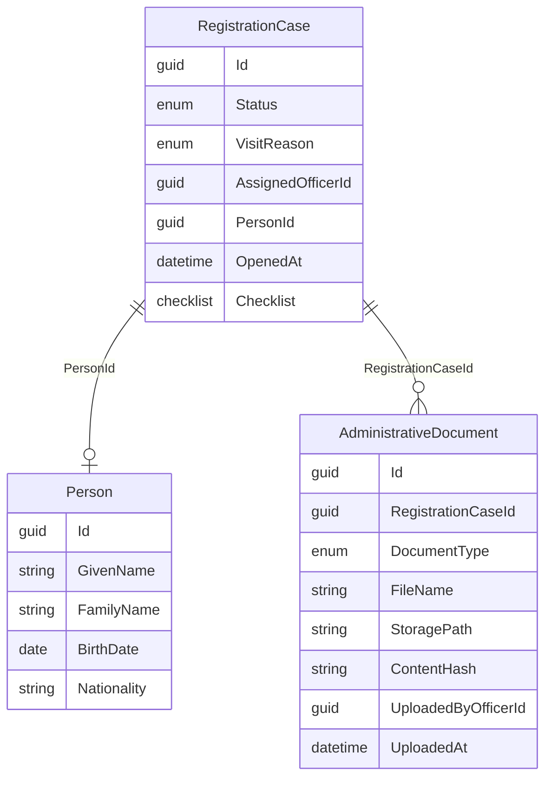

# Registration feature

The Registration bounded context manages first-registration procedures for the Population Department. A **RegistrationCase** aggregate tracks the intake workflow; related **Person** and **AdministrativeDocument** entities are created as the officer progresses through the case.

## Domain model

### Case status and checklist

| Status | Meaning |
|--------|---------|
| `Intake` | Case opened; identity and documents can be collected |
| `UnderReview` | (future) Case under review |
| Others | Defined in `RegistrationCaseStatus` for later phases |

The **checklist** tracks completeness flags (`IdentityEstablished`, `LegalResidenceEstablished`, etc.) independently of status. Recording identity sets `IdentityEstablished = true`.

## Slice documentation

- [List registration cases](./list-registration-cases.md)
- [Open registration case](./open-registration-case.md)
- [Get registration case](./get-registration-case.md)
- [Record identity](./record-identity.md)
- [Attach document](./attach-document.md)

## Route registration

All HTTP routes are registered in `RegistrationEndpoints.MapRegistrationEndpoints()` and mounted at `/api/registration`.

Handlers are registered as scoped services in `Program.cs`.
