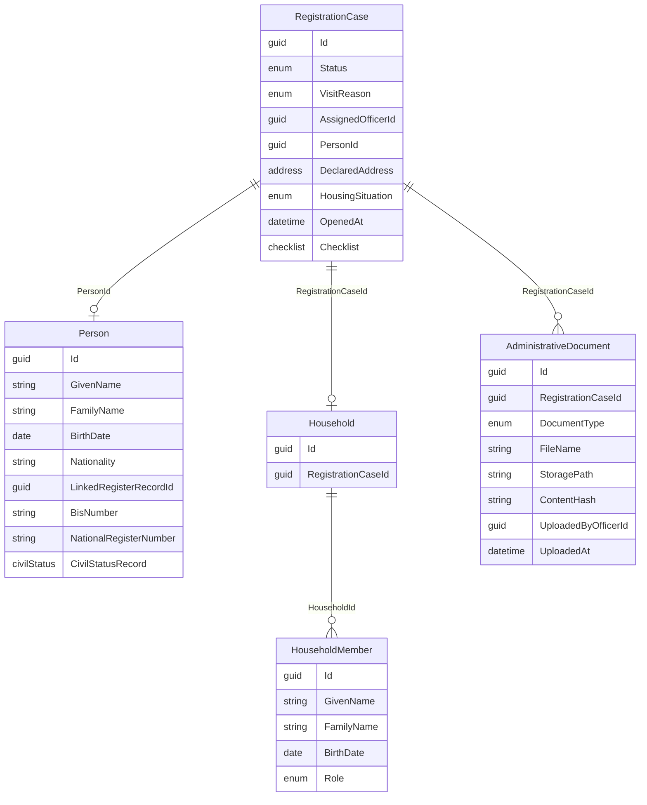
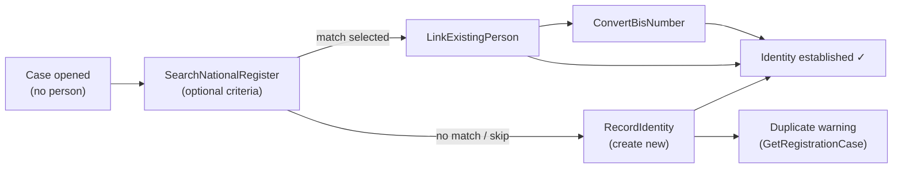

# Registration feature

The Registration bounded context manages first-registration procedures for the Population Department. A **RegistrationCase** aggregate tracks the intake workflow; related **Person** and **AdministrativeDocument** entities are created as the officer progresses through the case.

## Domain model

### Case status and checklist

| Status | Meaning |
|--------|---------|
| `Intake` | Case opened; identity, residence, and documents can be collected |
| `UnderReview` | (future) Case under review |
| Others | Defined in `RegistrationCaseStatus` for later phases |

The **checklist** tracks completeness flags (`IdentityEstablished`, `LegalResidenceEstablished`, `AddressDeclared`, etc.) independently of status. Recording identity sets `IdentityEstablished = true`; residence policies set `LegalResidenceEstablished` when evidence passes validation.

### Intake corrections (Phase 2.1)

Officers can fix mistakes on any intake step after saving — without reopening the case or losing later progress. Full phase notes: [phase-2.1-intake-corrections.md](../../phases/phase-2.1-intake-corrections.md).

#### When corrections are allowed

| Case status | Corrections |
|-------------|-------------|
| `Intake` | Allowed (primary use case) |
| `UnderReview` | Allowed |
| `Approved`, `Registered`, `Rejected` | Blocked — terminal or post-decision |

Domain guard: `RegistrationCase.EnsureIntakeDataEditable()` (also used by `EnsureCanAttachDocuments()`).

#### Record-or-correct convention

Each intake slice supports both first record and correction. Pick one pattern per slice:

| Approach | When to use | Registration examples |
|----------|-------------|----------------------|
| **Explicit `Correct*`** | First record and correction have different invariants | `RecordIdentity` / `CorrectIdentity` |
| **Upsert handler** | Create and update share the same validation | `SetResidenceCategory`, `RecordResidencePermit`, `RecordImmigrationDecision` |
| **Separate remove** | Attach-only model; correction = delete + re-attach | `AttachDocument` / `RemoveDocument` |

#### Checklist re-evaluation

Corrections must never leave stale checklist flags. After every correction handler saves:

1. Re-run relevant evaluators (`RegistrationResidenceEvaluator` today)
2. Update checklist on the aggregate (`ApplyResidencePolicyResult`, etc.)
3. Return policy state in the response so the UI can show warnings

#### UI pattern

Saved section → summary + **Edit** button → pre-filled form → save via correction handler → `ReloadCase()`. See [design-system edit form](../../design-system/06-page-templates.md#4-edit-form).

#### Slice map

| Step | First record | Correction |
|------|--------------|------------|
| Identity | `RecordIdentity` | `CorrectIdentity` — [doc](./correct-identity.md) |
| Residence category | `SetResidenceCategory` | Same handler (upsert) + edit UI |
| Residence permit | `RecordResidencePermit` | Same handler (upsert) + edit UI |
| Immigration decision | `RecordImmigrationDecision` | Same handler (upsert) + edit UI |
| Address | `DeclareAddress` | Same handler (upsert) + edit UI — [doc](./declare-address.md) |
| Housing situation | `RecordHousingSituation` | Same handler (upsert) + edit UI — [doc](./record-housing-situation.md) |
| Household | `RecordHouseholdComposition` | Same handler (upsert) + member list UI — [doc](./record-household-composition.md) |
| Civil status | `RecordCivilStatus` | Same handler (upsert) + edit UI — [doc](./record-civil-status.md) |
| Documents | `AttachDocument` | `RemoveDocument` — [doc](./remove-document.md) |

### National Register & identity (Phase 5)

Before creating a new person, officers should search the stubbed National Register. Phase notes: [phase-5-national-register-search-bis.md](../../phases/phase-5-national-register-search-bis.md).

| Step | Slice | Correction path |
|------|-------|-----------------|
| Search register | `SearchNationalRegister` | N/A (read-only) — [doc](./search-national-register.md) |
| Link existing | `LinkExistingPerson` | Not supported yet (Phase 5 scope) — [doc](./link-existing-person.md) |
| Create new person | `RecordIdentity` | `CorrectIdentity` — [doc](./record-identity.md) |
| Convert BIS → NR | `ConvertBisNumber` | One-way stub assignment — [doc](./convert-bis-number.md) |

**Partial search:** all search fields are optional individually; at least one of given name, family name, or birth date is required. Example: `givenName=Marie` returns Marie Leclerc; `familyName=Dupont` returns Jean and J. Dupont.

## Slice documentation

- [List registration cases](./list-registration-cases.md)
- [Open registration case](./open-registration-case.md)
- [Get registration case](./get-registration-case.md)
- [Record identity](./record-identity.md)
- [Correct identity](./correct-identity.md)
- [Search National Register](./search-national-register.md)
- [Link existing person](./link-existing-person.md)
- [Convert BIS number](./convert-bis-number.md)
- [Set residence category](./set-residence-category.md)
- [Record residence permit](./record-residence-permit.md)
- [Record immigration decision](./record-immigration-decision.md)
- [Declare address](./declare-address.md)
- [Record housing situation](./record-housing-situation.md)
- [Record household composition](./record-household-composition.md)
- [Record civil status](./record-civil-status.md)
- [Attach document](./attach-document.md)
- [Download document](./download-document.md)
- [Remove document](./remove-document.md)

## Route registration

All HTTP routes are registered in `RegistrationEndpoints.MapRegistrationEndpoints()` and mounted at `/api/registration`.

Handlers are registered as scoped services in `Program.cs`.
