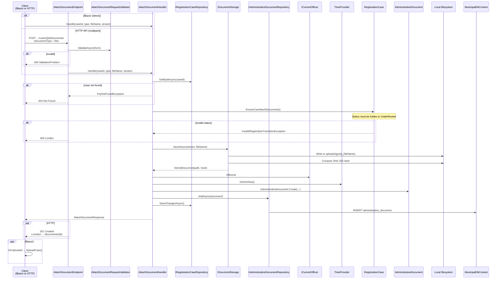

# Attach Document

Uploads a supporting document to a registration case: stores the file on disk and records metadata in the database.

## Overview

| | |
|---|---|
| **Handler** | `AttachDocumentHandler` |
| **Endpoint** | `AttachDocumentEndpoint` |
| **Validator** | `AttachDocumentRequestValidator` (validates `AttachDocumentForm`) |
| **Route** | `POST /api/registration/cases/{id}/documents` |
| **Blazor entry** | `DocumentUpload.razor` (embedded in `RegistrationCaseDetail.razor`) |
| **Response** | `AttachDocumentResponse(DocumentId, DocumentType, FileName, UploadedAt)` |

## Flow diagram



## Call chain

```
DocumentUpload.razor
  └─ Upload()
       ├─ IBrowserFile.OpenReadStream(max 10 MB)
       └─ AttachDocumentHandler.Handle(caseId, documentType, fileName, stream)
            ├─ IRegistrationCaseRepository.GetByIdAsync()
            ├─ RegistrationCase.EnsureCanAttachDocuments()   [Domain]
            ├─ IDocumentStorage.SaveAsync()                  [Infrastructure]
            │    └─ LocalFileDocumentStorage → uploads/ folder
            ├─ AdministrativeDocument.Create(...)            [Domain]
            ├─ IAdministrativeDocumentRepository.AddAsync()
            └─ IRegistrationCaseRepository.SaveChangesAsync()
```

## Domain logic

`RegistrationCase.EnsureCanAttachDocuments()` allows uploads only when status is:

- `Intake`, or
- `UnderReview`

`AdministrativeDocument.Create()` records metadata including storage path, content hash, uploading officer, and timestamp. The case aggregate itself is not modified beyond the status guard.

## File storage

`LocalFileDocumentStorage` (singleton):

1. Creates `uploads/` under the application content root
2. Saves file as `{guid}_{originalFileName}`
3. Computes SHA-256 hash of stored file
4. Returns relative path and hash

## Validation rules

| Field | Rule |
|-------|------|
| `DocumentType` | Must be a valid enum value |
| `File` | Required, non-empty |

Blazor additionally restricts file types to `.pdf`, `.jpg`, `.jpeg`, `.png` and max size 10 MB via `OpenReadStream`.

## HTTP request format

Multipart form data:

- `documentType`: enum value (e.g. `Passport`)
- `file`: binary file content

Antiforgery is disabled for this endpoint (`DisableAntiforgery()`) to allow programmatic uploads.

## Error responses

| Status | Condition | Blazor handling |
|--------|-----------|-----------------|
| `400` | Missing file or invalid document type | — |
| `404` | Case not found | — |
| `409` | Case status does not allow attachments | Snackbar with domain message |
| `201` | Success | Snackbar + page reload |

## Document types

| Value | Label |
|-------|-------|
| `Passport` | Passport |
| `NationalIdCard` | National ID card |
| `BirthCertificate` | Birth certificate |
| `ResidencePermit` | Residence permit |
| `Other` | Other |

## Correction path

Document correction is **remove + re-attach** (see [intake corrections](./README.md#intake-corrections-phase-21)):

1. [Remove document](./remove-document.md) — `DELETE …/documents/{documentId}` deletes the row and stored file
2. Attach a replacement via this slice

There is no in-place replace handler in Phase 2.1.

## Dependencies

| Dependency | Role |
|------------|------|
| `IRegistrationCaseRepository` | Load case, commit transaction |
| `IAdministrativeDocumentRepository` | Persist document metadata |
| `IDocumentStorage` | Store file on disk |
| `ICurrentOfficer` | Record uploading officer |
| `TimeProvider` | Upload timestamp |
