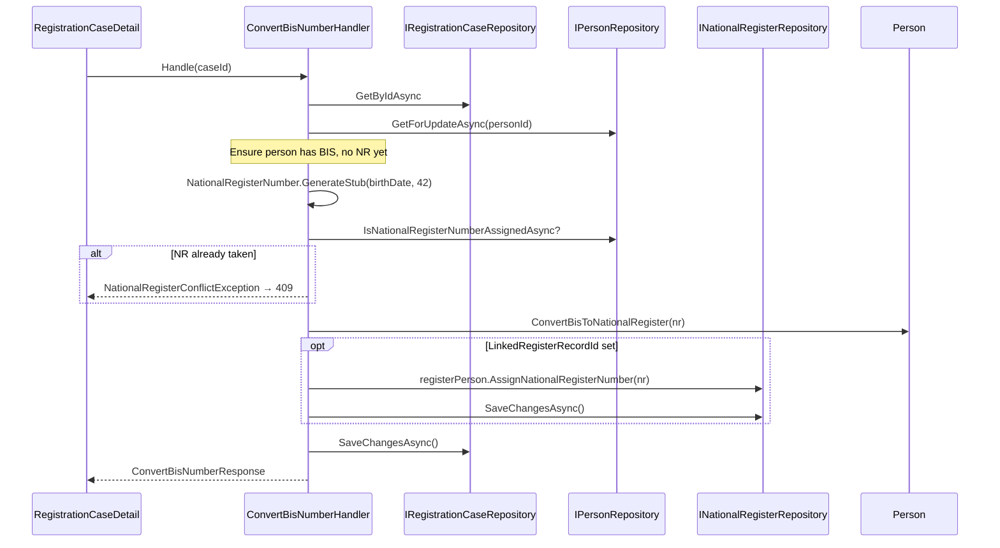

# Convert BIS Number

Converts a person's BIS number to a National Register number using a simplified stub generator. Educational simulation of the real municipal process where a BIS identity becomes a full NR registration.

## Overview

| | |
|---|---|
| **Handler** | `ConvertBisNumberHandler` |
| **Endpoint** | `ConvertBisNumberEndpoint` |
| **Route** | `POST /api/registration/cases/{id}/identity/convert-bis` |
| **Blazor entry** | `RegistrationCaseDetail.razor` (Convert button on identity card) |
| **Request** | None (case ID in route) |
| **Response** | `ConvertBisNumberResponse(CaseId, PersonId, BisNumber, NationalRegisterNumber)` |

## When to use

Show the **Convert BIS to National Register number** button when:

- Case is editable (`Intake` or `UnderReview`)
- Person has a `BisNumber`
- Person does not yet have a `NationalRegisterNumber`

Typical flow: officer linked Marie Leclerc (BIS-only seed record) via [link existing person](./link-existing-person.md), then converts before proceeding with registration.

## Flow diagram



## Domain logic

`Person.ConvertBisToNationalRegister()`:

1. Requires existing `BisNumber`
2. Rejects if `NationalRegisterNumber` already set
3. Assigns the new NR number (BIS retained for audit trail)

Stub generation: `NationalRegisterNumber.GenerateStub(birthDate, sequence)` — 6-digit birth date + 3-digit sequence + 2 mod97 check digits.

If the person was linked from the register stub, the seed `NationalRegisterPerson` record is also updated so future searches show the NR.

## Error responses

| Status | Condition |
|--------|-----------|
| `404` | Case or person not found |
| `409` | No BIS on person; NR already assigned; case not editable; generated NR collision |
| `200` | Success |

## Response example

```json
{
  "caseId": "3fa85f64-5717-4562-b3fc-2c963f66afa6",
  "personId": "...",
  "bisNumber": "75010112345",
  "nationalRegisterNumber": "75010104211"
}
```

(Exact NR value depends on stub generator output for birth date + sequence 42.)

## UI behaviour

- Button on identity card when `CanConvertBis` is true
- Success snackbar shows formatted NR number
- Case reloads; convert button disappears; NR line appears on card

## Educational simplification

Real NR assignment involves federal register integration, checksum validation against official rules, and register-type decisions at approval time (Phase 7). This slice:

- Uses a deterministic stub formula
- Assigns on officer action, not on case approval
- Does not choose Population vs Foreigners register

Phase 7 `AssignNationalRegisterNumber` may refine or replace this behaviour.

## Dependencies

| Dependency | Role |
|------------|------|
| `IRegistrationCaseRepository` | Load case; persist after person update |
| `IPersonRepository` | Load person for update; NR collision check |
| `INationalRegisterRepository` | Update linked stub record when applicable |

## Related slices

- [Link existing person](./link-existing-person.md) — typical prerequisite
- [Search National Register](./search-national-register.md)
- Phase 7 (planned) — official registration and register target selection
