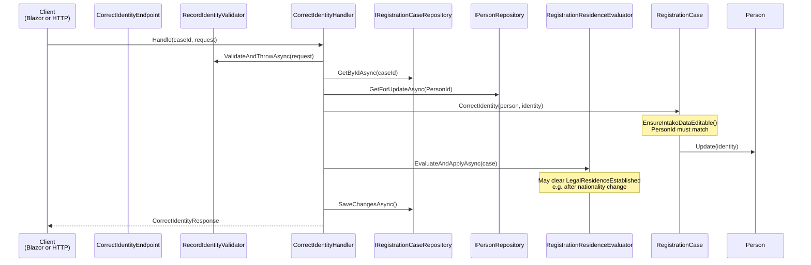

# Correct Identity

Corrects a previously recorded identity on a registration case without reopening the case or losing later intake progress.

This slice is the **explicit `Correct*`** example of the [intake correction pattern](./README.md#intake-corrections-phase-21) introduced in [Phase 2.1](../../phases/phase-2.1-intake-corrections.md). Identity uses a separate handler and domain method because first-record and correction have different invariants (`PersonId` must be null vs must already be set).

## Overview

| | |
|---|---|
| **Handler** | `CorrectIdentityHandler` |
| **Endpoint** | `CorrectIdentityEndpoint` |
| **Validator** | `RecordIdentityValidator` (shared with [Record identity](./record-identity.md)) |
| **Route** | `PUT /api/registration/cases/{id}/identity` |
| **Blazor entry** | `RegistrationCaseDetail.razor` (identity edit mode) |
| **Request** | `RecordIdentityRequest(GivenName, FamilyName, BirthDate, Nationality)` — same shape as first record |
| **Response** | `CorrectIdentityResponse(CaseId, PersonId, IdentityEstablished, LegalResidenceEstablished, PolicyMessage)` |

## First record vs correction

| | First record | Correction |
|---|---|---|
| **Slice** | [Record identity](./record-identity.md) | Correct identity (this doc) |
| **HTTP** | `POST …/identity` | `PUT …/identity` |
| **Domain** | `RegistrationCase.RecordIdentity()` | `RegistrationCase.CorrectIdentity()` |
| **Person** | `Person.Create()` + `AddAsync` | `Person.Update()` on existing row |
| **Guard** | Status = `Intake`; `PersonId` must be null | `EnsureIntakeDataEditable()`; `PersonId` must be set |
| **Checklist** | Sets `IdentityEstablished` | `IdentityEstablished` stays `true` |

## Flow diagram



## Call chain

```
RegistrationCaseDetail.razor
  └─ SaveIdentityCorrection()
       ├─ MudForm.Validate()                         [client-side]
       └─ CorrectIdentityHandler.Handle(caseId, request)
            ├─ RecordIdentityValidator.ValidateAndThrowAsync()
            ├─ IRegistrationCaseRepository.GetByIdAsync()
            ├─ IPersonRepository.GetForUpdateAsync()
            ├─ RegistrationCase.CorrectIdentity()      [Domain]
            │    └─ Person.Update()                    [Domain]
            ├─ RegistrationResidenceEvaluator.EvaluateAndApplyAsync()
            └─ IRegistrationCaseRepository.SaveChangesAsync()
```

## Domain logic

`RegistrationCase.CorrectIdentity()` enforces:

1. Case must be in `Intake` or `UnderReview` via `EnsureIntakeDataEditable()`
2. Identity must already be recorded (`PersonId` must be set)
3. The supplied `Person` must match `PersonId`
4. Updates the person via `Person.Update(IdentityDetails)` (trim + validate like `Create`)
5. `IdentityEstablished` remains `true` — correction does not unset the checklist flag

`Person.Update()` mutates the existing aggregate; no new `Person` row is created.

## Checklist re-evaluation and cascade

After every identity correction, `RegistrationResidenceEvaluator` re-runs so checklist flags are never stale:

1. Load current permit and attached documents
2. Evaluate residence policy for the (possibly changed) identity context
3. Call `ApplyResidencePolicyResult()` — may set or clear `LegalResidenceEstablished`

| Correction | Typical side effect |
|------------|-------------------|
| Name or birth date only | Checklist usually unchanged |
| Nationality change | Policy may fail; `LegalResidenceEstablished` may clear until residence evidence is reviewed |

The response includes `LegalResidenceEstablished` and `PolicyMessage` so the UI can show a warning snackbar when correction leaves legal residence invalid.

## UI: edit form pattern

Follows the [design-system edit form](../../design-system/06-page-templates.md#4-edit-form):

- **Saved state** — summary card with **Edit** button (hidden when case is not editable)
- **Edit mode** — form pre-filled from `_case.Person`; `AppSaveCancelBar` disabled until dirty
- **Cancel** — `AppConfirmDialog` when there are unsaved changes
- **Save** — `CorrectIdentityHandler` → `ReloadCase()` → checklist chips refresh

Edit is only offered when `Status` is `Intake` or `UnderReview`.

## Validation rules

Same as [Record identity](./record-identity.md#validation-rules) — shared `RecordIdentityValidator`.

## Request example

```json
{
  "givenName": "Jean",
  "familyName": "Vermeulen",
  "birthDate": "1988-11-05",
  "nationality": "Belgian"
}
```

## Error responses

| Status | Condition | Blazor handling |
|--------|-----------|-----------------|
| `400` | Validation failure | Snackbar with validation messages |
| `404` | Case or person not found | — |
| `409` | Identity not recorded, wrong person, or case not editable | Snackbar with domain message |
| `200` | Success | Snackbar + optional policy warning + page reload |

## National Register link (Phase 5 limitation)

If identity was established via [Link existing person](./link-existing-person.md), `CorrectIdentity` only updates name, date of birth, and nationality through `Person.Update()`. It does **not**:

- Clear `LinkedRegisterRecordId`, `BisNumber`, or `NationalRegisterNumber`
- Update the stub `national_register_persons` row
- Support unlink-and-re-link to a different register record

Changing identity on a linked person may cause the [duplicate warning](./search-national-register.md) to reappear or disagree with the linked register record. Unlink/re-link is deferred — see [Phase 5 carries forward](../../phases/phase-5-national-register-search-bis.md#carries-forward).

## Audit

Structured log at handler level: case id, person id, timestamp (`ILogger`). Persistent `CaseAuditEntry` is Phase 7 scope.

## Dependencies

| Dependency | Role |
|------------|------|
| `IRegistrationCaseRepository` | Load and persist case |
| `IPersonRepository` | Load tracked person for update |
| `RegistrationResidenceEvaluator` | Re-run policy after correction |
| `IValidator<RecordIdentityRequest>` | Shared input validation |

## Related

- [Record identity](./record-identity.md) — first-time recording (`POST`)
- [Link existing person](./link-existing-person.md) — alternative first-time path; limited correction support (see above)
- [Phase 2.1 — Intake corrections](../../phases/phase-2.1-intake-corrections.md) — cross-cutting correction policy
- [ADR-0004](../../adr/0004-checklist-over-linear-state-machine.md) — flexible, non-linear intake rationale
