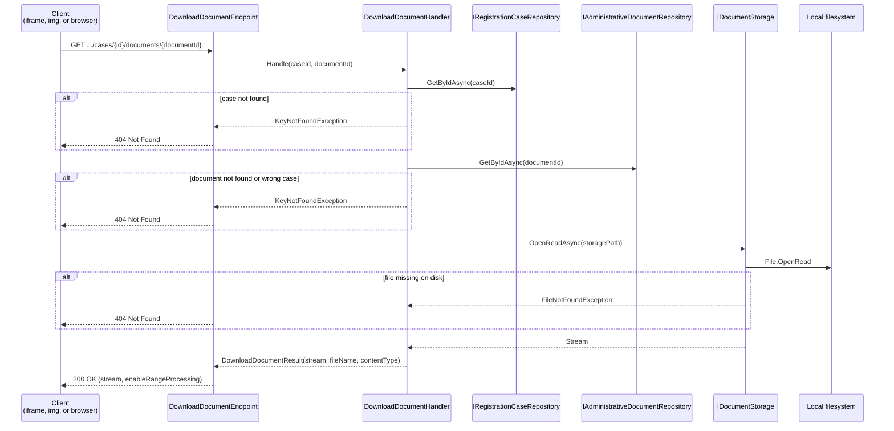

# Download Document

Streams an attached document from storage so officers can preview it in the browser or download it.

Introduced in [Phase 4.1](../../phases/phase-4.1-document-preview-case-ux.md).

## Overview

| | |
|---|---|
| **Handler** | `DownloadDocumentHandler` |
| **Endpoint** | `DownloadDocumentEndpoint` |
| **Route** | `GET /api/registration/cases/{id}/documents/{documentId}` |
| **Blazor consumers** | `RegistrationCaseDocumentPanel` → `DocumentPreviewContent`, `DocumentPreviewDialog` |
| **Response** | Binary stream with `Content-Type` derived from file extension |

## Flow diagram



## Call chain

```
RegistrationCaseDocumentPanel.razor
  └─ GetDocumentUrl(documentId)
       └─ /api/registration/cases/{caseId}/documents/{documentId}
            └─ DownloadDocumentEndpoint.Handle()
                 └─ DownloadDocumentHandler.Handle()
                      ├─ IRegistrationCaseRepository.GetByIdAsync()
                      ├─ IAdministrativeDocumentRepository.GetByIdAsync()
                      │    └─ verifies document.RegistrationCaseId == caseId
                      └─ IDocumentStorage.OpenReadAsync()
                           └─ LocalFileDocumentStorage → uploads/ folder
```

## Content types

| Extension | `Content-Type` |
|-----------|----------------|
| `.pdf` | `application/pdf` |
| `.jpg`, `.jpeg` | `image/jpeg` |
| `.png` | `image/png` |
| other | `application/octet-stream` |

## Preview behaviour

`DocumentPreviewContent` embeds the download URL directly:

- **PDF** — `<iframe src="…">` (browser PDF viewer)
- **Images** — ``
- **Other** — `AppEmptyState` with message to download manually

The same URL powers the **Download** link (`target="_blank"`) and the fullscreen `DocumentPreviewDialog`.

## Error responses

| Status | Condition |
|--------|-----------|
| `404` | Case not found, document not found, document on another case, or file missing on disk |

No explicit auth check beyond the existing registration API group — same as other case endpoints in development.

## Dependencies

| Dependency | Role |
|------------|------|
| `IRegistrationCaseRepository` | Verify case exists |
| `IAdministrativeDocumentRepository` | Load document metadata and case ownership |
| `IDocumentStorage` | Open read stream from stored path |

## Related slices

- [Attach document](./attach-document.md) — upload
- [Remove document](./remove-document.md) — delete
