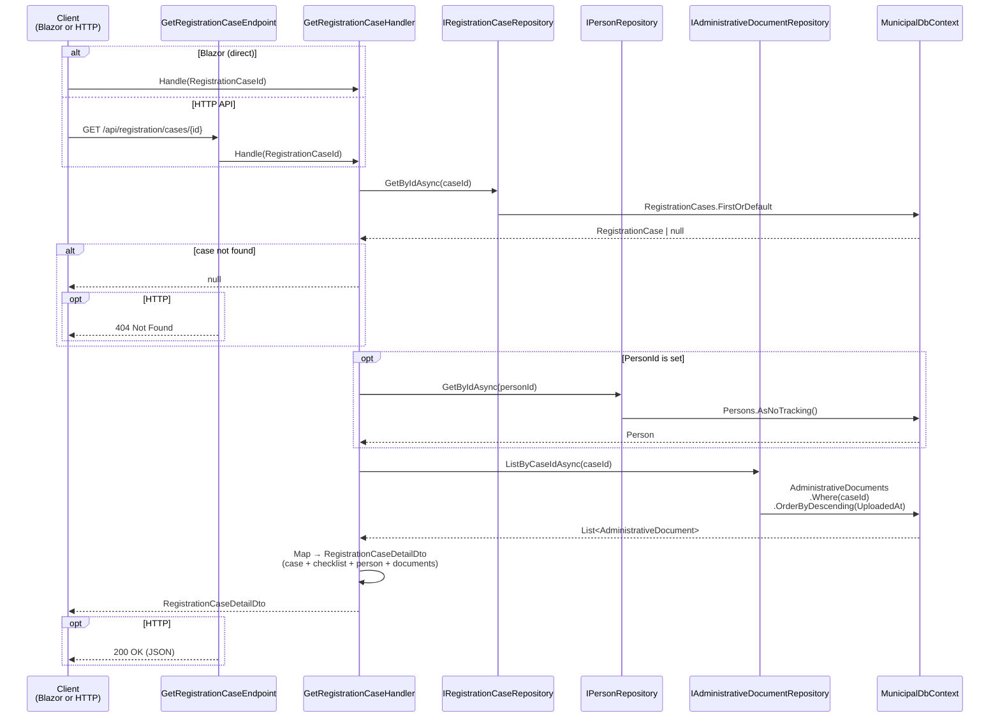

# Get Registration Case

Loads a single registration case with its checklist, linked person (if any), and attached documents.

## Overview

| | |
|---|---|
| **Handler** | `GetRegistrationCaseHandler` |
| **Endpoint** | `GetRegistrationCaseEndpoint` |
| **Route** | `GET /api/registration/cases/{id}` |
| **Blazor page** | `RegistrationCaseDetail.razor` (`/registration/cases/{CaseId}`) |
| **Response** | `RegistrationCaseDetailDto` or `null` |

## Flow diagram



## Call chain

```
RegistrationCaseDetail.razor
  └─ OnParametersSetAsync → ReloadCase()
       └─ GetRegistrationCaseHandler.Handle(RegistrationCaseId)
            ├─ IRegistrationCaseRepository.GetByIdAsync()
            ├─ IPersonRepository.GetByIdAsync()        [if PersonId set]
            ├─ IAdministrativeDocumentRepository.ListByCaseIdAsync()
            └─ Map() → RegistrationCaseDetailDto
```

The same handler is called again after identity recording or document upload to refresh the page.

## Response shape

```json
{
  "id": "3fa85f64-5717-4562-b3fc-2c963f66afa6",
  "status": "Intake",
  "visitReason": "FirstRegistration",
  "assignedOfficerId": "11111111-1111-1111-1111-111111111111",
  "openedAt": "2026-07-04T10:30:00+00:00",
  "checklist": {
    "identityEstablished": true,
    "legalResidenceEstablished": false,
    "addressDeclared": false,
    "addressConfirmed": false,
    "registerDeterminable": false
  },
  "person": {
    "id": "...",
    "givenName": "Luc",
    "familyName": "Vermeulen",
    "birthDate": "1988-11-05",
    "nationality": "Belgian"
  },
  "documents": [
    {
      "id": "...",
      "documentType": "Passport",
      "fileName": "passport.pdf",
      "uploadedAt": "2026-07-04T11:00:00+00:00"
    }
  ]
}
```

When identity has not been recorded, `person` is `null`.

## Blazor UI behaviour

`RegistrationCaseDetail.razor` uses the DTO to:

- Show case header (status chip, visit reason, opened date)
- Render checklist status chips
- Show identity form **or** read-only person card (based on `person == null`)
- Embed `DocumentUpload` component
- List attached documents

## Error responses (HTTP)

| Status | Condition |
|--------|-----------|
| `404` | Case ID not found |
| `200` | Success |

## Dependencies

| Dependency | Role |
|------------|------|
| `IRegistrationCaseRepository` | Load case aggregate |
| `IPersonRepository` | Load linked person |
| `IAdministrativeDocumentRepository` | Load case documents |

This is a read-only slice with no domain mutations.
