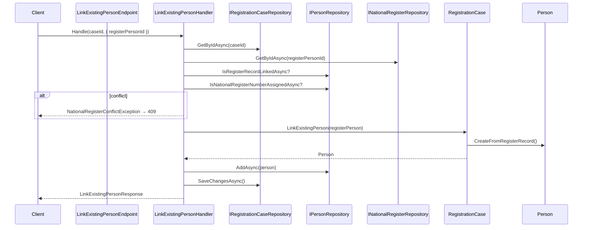

# Link Existing Person

Links a registration case to an existing National Register stub record instead of creating a new person. Copies identity and BIS/NR numbers from the register into a new `Person` entity.

## Overview

| | |
|---|---|
| **Handler** | `LinkExistingPersonHandler` |
| **Endpoint** | `LinkExistingPersonEndpoint` |
| **Validator** | `LinkExistingPersonValidator` |
| **Route** | `POST /api/registration/cases/{id}/identity/link` |
| **Blazor entry** | `NationalRegisterSearchDialog.razor` (Link button) |
| **Request** | `LinkExistingPersonRequest(RegisterPersonId)` |
| **Response** | `LinkExistingPersonResponse(CaseId, PersonId, IdentityEstablished, BisNumber?, NationalRegisterNumber?, LinkedFromRegister)` |

## Flow diagram



## Call chain

```
NationalRegisterSearchDialog.razor
  └─ LinkMatch(match)
       └─ LinkExistingPersonHandler.Handle(caseId, request)
            ├─ LinkExistingPersonValidator
            ├─ IRegistrationCaseRepository.GetByIdAsync()
            ├─ INationalRegisterRepository.GetByIdAsync()
            ├─ IPersonRepository.IsRegisterRecordLinkedAsync()
            ├─ IPersonRepository.IsNationalRegisterNumberAssignedAsync()
            ├─ RegistrationCase.LinkExistingPerson()
            │    └─ Person.CreateFromRegisterRecord()
            ├─ IPersonRepository.AddAsync()
            └─ IRegistrationCaseRepository.SaveChangesAsync()
```

## Domain logic

`RegistrationCase.LinkExistingPerson()` enforces:

1. Case must be in `Intake` status
2. Identity must not already be recorded (`PersonId` is null)
3. Creates person via `Person.CreateFromRegisterRecord(registerPerson)`
4. Sets `PersonId` and `Checklist.IdentityEstablished`

`Person.CreateFromRegisterRecord` copies:

- Given name, family name, birth date, nationality
- `LinkedRegisterRecordId`
- `BisNumber` and/or `NationalRegisterNumber` from the stub record

## Conflict rules

| Condition | Exception | HTTP |
|-----------|-----------|------|
| Register record already linked to another person | `NationalRegisterConflictException` | 409 |
| NR number already assigned to another person | `NationalRegisterConflictException` | 409 |
| Identity already on case | `InvalidRegistrationTransitionException` | 409 |
| Case not in Intake | `InvalidRegistrationTransitionException` | 409 |
| Register record not found | `KeyNotFoundException` | 404 |

## Request example

```json
{
  "registerPersonId": "aaaaaaaa-0001-4000-8000-000000000001"
}
```

## Response example

```json
{
  "caseId": "3fa85f64-5717-4562-b3fc-2c963f66afa6",
  "personId": "...",
  "identityEstablished": true,
  "bisNumber": "75010112345",
  "nationalRegisterNumber": null,
  "linkedFromRegister": true
}
```

## UI behaviour

After successful link:

- Dialog closes
- Case detail reloads
- Identity card shows **Linked from National Register** chip
- BIS/NR numbers displayed when present
- **Convert BIS** button visible if BIS-only (see [convert-bis-number.md](./convert-bis-number.md))

## Comparison with Record Identity

| | Link existing | Record identity (create new) |
|---|---|---|
| Route | `POST …/identity/link` | `POST …/identity` |
| Person source | Register stub | Officer-entered form |
| `LinkedRegisterRecordId` | Set | null |
| BIS/NR | Copied from stub | null |
| Duplicate warning | Unlikely (linked) | Possible if matches exist |

## Dependencies

| Dependency | Role |
|------------|------|
| `IRegistrationCaseRepository` | Load and persist case |
| `IPersonRepository` | Persist person; conflict checks |
| `INationalRegisterRepository` | Load register record by ID |

## Related slices

- [Search National Register](./search-national-register.md) — find `registerPersonId`
- [Convert BIS number](./convert-bis-number.md) — next step for BIS-only links
- [Record identity](./record-identity.md) — alternative path
