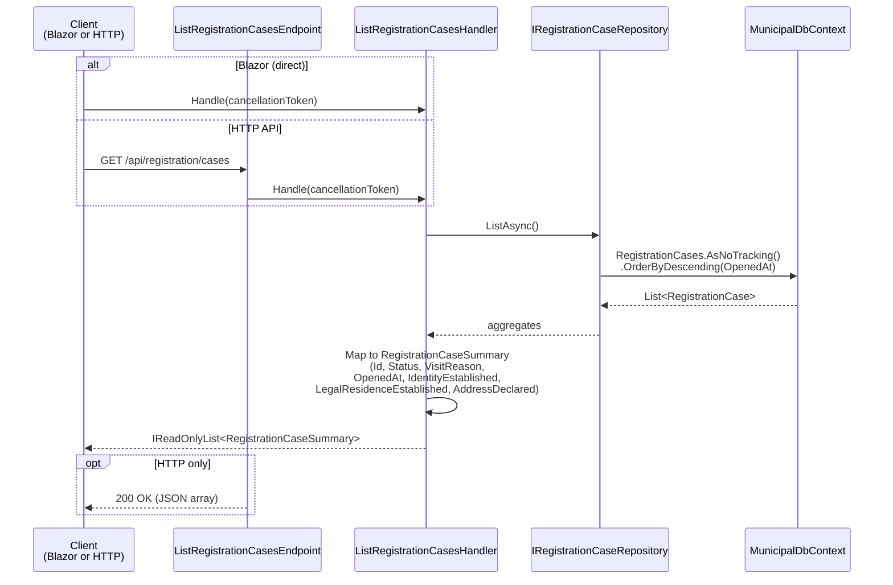

# List Registration Cases

Returns a summary list of all registration cases, ordered by most recently opened first.

## Overview

| | |
|---|---|
| **Handler** | `ListRegistrationCasesHandler` |
| **Endpoint** | `ListRegistrationCasesEndpoint` |
| **Route** | `GET /api/registration/cases` |
| **Blazor page** | `RegistrationCaseList.razor` (`/registration/cases`) |
| **Response** | `IReadOnlyList<RegistrationCaseSummary>` |

## Flow diagram



## Call chain

```
RegistrationCaseList.razor
  └─ OnInitializedAsync → LoadCases()
       └─ ListRegistrationCasesHandler.Handle()
            └─ IRegistrationCaseRepository.ListAsync()
                 └─ MunicipalDbContext.RegistrationCases (read-only query)
            └─ .Select() → RegistrationCaseSummary DTOs
```

## Blazor UI behaviour

On page load, `RegistrationCaseList.razor`:

1. Calls the handler directly (no HTTP).
2. Applies client-side search filtering on case ID, visit reason, and status.
3. Renders an `AppDataTable` with row click navigation to `/registration/cases/{id}`.
4. The **Progress** column uses `RegistrationCaseChecklistProgress` — `n/3` plus icons for identity, legal residence, and address (Phase 4.1).

The page also hosts the **New case** dialog (see [open-registration-case.md](./open-registration-case.md)).

## Response shape

```json
[
  {
    "id": "3fa85f64-5717-4562-b3fc-2c963f66afa6",
    "status": "Intake",
    "visitReason": "FirstRegistration",
    "openedAt": "2026-07-04T10:30:00+00:00",
    "identityEstablished": false,
    "legalResidenceEstablished": false,
    "addressDeclared": false
  }
]
```

## Dependencies

| Dependency | Role |
|------------|------|
| `IRegistrationCaseRepository` | Read all cases from database |

No validation or domain mutations occur in this read-only slice.
