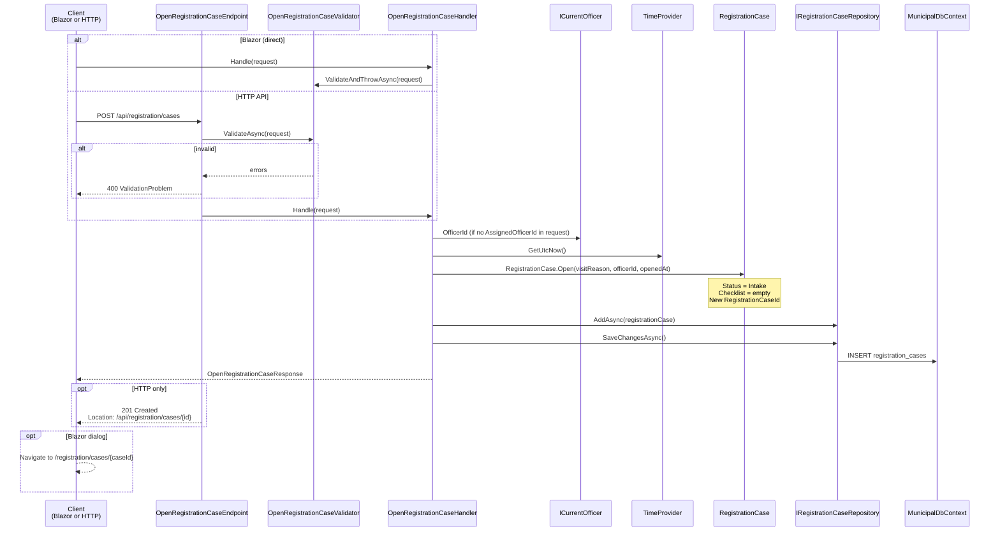

# Open Registration Case

Creates a new registration case in `Intake` status and assigns it to an officer.

## Overview

| | |
|---|---|
| **Handler** | `OpenRegistrationCaseHandler` |
| **Endpoint** | `OpenRegistrationCaseEndpoint` |
| **Validator** | `OpenRegistrationCaseValidator` |
| **Route** | `POST /api/registration/cases` |
| **Blazor entry** | `NewCaseDialog.razor` (opened from `RegistrationCaseList.razor`) |
| **Request** | `OpenRegistrationCaseRequest(VisitReason, Guid? AssignedOfficerId)` |
| **Response** | `OpenRegistrationCaseResponse(CaseId, Status, VisitReason, OpenedAt)` |

## Flow diagram



## Call chain

```
RegistrationCaseList.razor
  └─ OpenNewCaseDialog()
       └─ NewCaseDialog.razor → Submit()
            └─ OpenRegistrationCaseHandler.Handle(request)
                 ├─ OpenRegistrationCaseValidator.ValidateAndThrowAsync()
                 ├─ ICurrentOfficer.OfficerId (default assignee)
                 ├─ TimeProvider.GetUtcNow()
                 ├─ RegistrationCase.Open(...)          [Domain]
                 ├─ IRegistrationCaseRepository.AddAsync()
                 └─ IRegistrationCaseRepository.SaveChangesAsync()
```

## Domain logic

`RegistrationCase.Open()` factory method:

- Generates a new `RegistrationCaseId`
- Sets status to `Intake`
- Initializes an empty checklist
- Records visit reason, assigned officer, and timestamp

No domain events are raised in the current implementation.

## Validation rules

| Field | Rule |
|-------|------|
| `VisitReason` | Must be a valid enum value |

## Request example

```json
{
  "visitReason": "FirstRegistration",
  "assignedOfficerId": null
}
```

When `assignedOfficerId` is null, the current officer from `ICurrentOfficer` is used.

## Error responses (HTTP)

| Status | Condition |
|--------|-----------|
| `400` | Validation failure (invalid visit reason) |
| `201` | Success |

## Dependencies

| Dependency | Role |
|------------|------|
| `IRegistrationCaseRepository` | Persist new case |
| `ICurrentOfficer` | Default officer assignment |
| `TimeProvider` | Consistent UTC timestamps |
| `IValidator<OpenRegistrationCaseRequest>` | Input validation |
