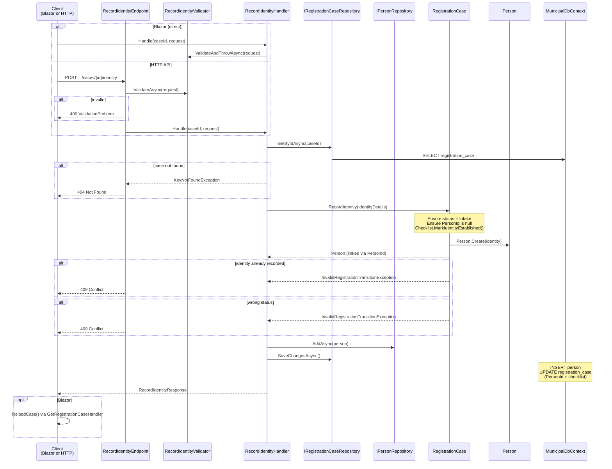

# Record Identity

Records the applicant's identity on a registration case, creating a linked `Person` entity and updating the checklist.

## Overview

| | |
|---|---|
| **Handler** | `RecordIdentityHandler` |
| **Endpoint** | `RecordIdentityEndpoint` |
| **Validator** | `RecordIdentityValidator` |
| **Route** | `POST /api/registration/cases/{id}/identity` |
| **Blazor entry** | `RegistrationCaseDetail.razor` (identity form) |
| **Request** | `RecordIdentityRequest(GivenName, FamilyName, BirthDate, Nationality)` |
| **Response** | `RecordIdentityResponse(CaseId, PersonId, IdentityEstablished)` |

## Flow diagram



## Call chain

```
RegistrationCaseDetail.razor
  └─ SaveIdentity()
       ├─ MudForm.Validate()                    [client-side]
       └─ RecordIdentityHandler.Handle(caseId, request)
            ├─ RecordIdentityValidator.ValidateAndThrowAsync()
            ├─ IRegistrationCaseRepository.GetByIdAsync()
            ├─ RegistrationCase.RecordIdentity()   [Domain]
            │    └─ Person.Create()              [Domain]
            ├─ IPersonRepository.AddAsync()
            └─ IRegistrationCaseRepository.SaveChangesAsync()
```

## Domain logic

`RegistrationCase.RecordIdentity()` enforces:

1. Case must be in `Intake` status
2. Identity must not already be recorded (`PersonId` must be null)
3. Creates a `Person` via `Person.Create(IdentityDetails)`
4. Sets `PersonId` on the case
5. Calls `Checklist.MarkIdentityEstablished()`

`Person.Create()` trims names and validates non-empty strings.

## Validation rules

| Field | Rule |
|-------|------|
| `GivenName` | Required, non-empty |
| `FamilyName` | Required, non-empty |
| `BirthDate` | Must be in the past |
| `Nationality` | Required, non-empty |

## Request example

```json
{
  "givenName": "Luc",
  "familyName": "Vermeulen",
  "birthDate": "1988-11-05",
  "nationality": "Belgian"
}
```

## Error responses

| Status | Condition | Blazor handling |
|--------|-----------|-----------------|
| `400` | Validation failure | Snackbar with validation messages |
| `404` | Case not found | — |
| `409` | Identity already recorded or wrong status | Snackbar with domain message |
| `200` | Success | Snackbar + page reload |

## State change

```mermaid
stateDiagram-v2
    [*] --> Intake: OpenRegistrationCase
    Intake --> Intake: RecordIdentity<br/>(PersonId set,<br/>IdentityEstablished = true)
    note right of Intake: Case stays in Intake;<br/>only checklist updates
```



## Dependencies

| Dependency | Role |
|------------|------|
| `IRegistrationCaseRepository` | Load and persist case |
| `IPersonRepository` | Persist new person |
| `IValidator<RecordIdentityRequest>` | Input validation |
