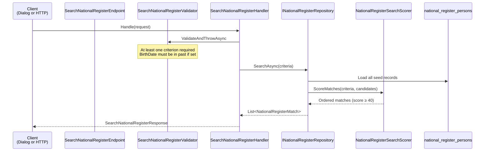

# Search National Register

Searches the stubbed National Register for possible matches before creating a new person file. Supports **partial criteria** — any combination of given name, family name, and date of birth, with at least one field required.

## Overview

| | |
|---|---|
| **Handler** | `SearchNationalRegisterHandler` |
| **Endpoint** | `SearchNationalRegisterEndpoint` |
| **Validator** | `SearchNationalRegisterValidator` |
| **Route** | `GET /api/registration/national-register/search` |
| **Blazor entry** | `NationalRegisterSearchDialog.razor` |
| **Request** | `SearchNationalRegisterRequest(GivenName?, FamilyName?, BirthDate?)` |
| **Response** | `SearchNationalRegisterResponse(Matches)` |

## Flow diagram



## Call chain

```
NationalRegisterSearchDialog.razor
  └─ Search()
       └─ SearchNationalRegisterHandler.Handle(request)
            ├─ SearchNationalRegisterValidator.ValidateAndThrowAsync()
            ├─ INationalRegisterRepository.SearchAsync()
            │    └─ NationalRegisterSearchScorer.ScoreMatches()
            └─ Map → NationalRegisterMatchDto list
```

Also invoked indirectly by `GetRegistrationCaseHandler` when computing `PossibleDuplicateMatches` for the duplicate warning banner (uses the case person's identity as criteria).

## Validation rules

| Rule | Detail |
|------|--------|
| At least one criterion | `GivenName`, `FamilyName`, or `BirthDate` must be provided |
| `BirthDate` | When provided, must be before today |

No field is individually required — partial search is intentional.

## Scoring

See [phase-5-national-register-search-bis.md](../../phases/phase-5-national-register-search-bis.md#search-scoring) for the full score table.

Summary:

| Score | Meaning |
|-------|---------|
| 100 | Exact name + birth date |
| 80 | Birth date + similar name |
| 50 | Name match without birth date alignment |
| 40 | Single-field partial match |

Results are ordered by score descending, then family name, then given name.

## Request examples

**Partial — given name only:**

```
GET /api/registration/national-register/search?givenName=Marie
```

**Partial — family name only:**

```
GET /api/registration/national-register/search?familyName=Dupont
```

**Full criteria:**

```
GET /api/registration/national-register/search?givenName=Am%C3%A9lie&familyName=Bernard&birthDate=1992-03-20
```

## Response example

```json
{
  "matches": [
    {
      "registerPersonId": "aaaaaaaa-0001-4000-8000-000000000001",
      "givenName": "Marie",
      "familyName": "Leclerc",
      "birthDate": "1975-01-01",
      "nationality": "Belgian",
      "bisNumber": "75010112345",
      "nationalRegisterNumber": null,
      "matchScore": 40,
      "matchReason": "Given name matches."
    }
  ]
}
```

Empty `matches` array when no candidate scores ≥ 40.

## Error responses

| Status | Condition |
|--------|-----------|
| `400` | No search criterion provided, or birth date in future |
| `200` | Success (including zero results) |

## UI behaviour

`NationalRegisterSearchDialog`:

- Pre-fills criteria from the identity form when opened from case detail
- Shows results in a `MudTable` with score chip and **Link** button per row
- Zero results → `AppInfoBox` suggesting create-new on the case
- Link success closes dialog and reloads case detail

## Dependencies

| Dependency | Role |
|------------|------|
| `INationalRegisterRepository` | Load seed records and delegate scoring |
| `NationalRegisterSearchScorer` | Domain scoring logic |
| `IValidator<SearchNationalRegisterRequest>` | Input validation |

Read-only slice — no domain mutations.

## Related slices

- [Link existing person](./link-existing-person.md) — act on a search result
- [Record identity](./record-identity.md) — create new when no suitable match
- [Get registration case](./get-registration-case.md) — duplicate detection on read
