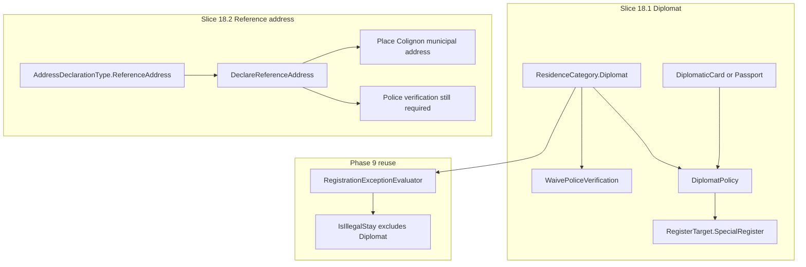

# Phase 18 — Remaining exception scenarios

- **Status:** Complete
- **Completed:** July 2026
- **Goal:** Implement the **low-priority exception slices** deferred from Phase 9 — diplomat register rules and homeless reference address.
- **Maps to IDEA:** Major exceptions for special legal statuses and domicile without fixed abode.

---

## Summary

Phase 9 delivered high- and medium-priority exception handling on the first-registration path. Phase 18 adds the two deferred slices:

| Scenario | Status |
|----------|--------|
| Diplomat separate rules | Done (18.1) |
| Homeless reference address | Done (18.2) |

Demo-quality rules: one clear path per exception — not full Vienna Convention or social-housing workflows. The Phase 9 `RegistrationExceptionEvaluator` is extended only for illegal-stay exclusion; residence re-evaluation continues via existing `SetResidenceCategoryHandler`. Homeless reference address is an address-declaration branch orthogonal to the evaluator.

---

## Architecture

---

## What was built

### Slice 18.1 — Diplomat

- `ResidenceCategory.Diplomat` + `DocumentType.DiplomaticCard`
- `DiplomatPolicy` — valid with Passport or DiplomaticCard (no permit / federal decision)
- `RegisterTargetResolver` → `SpecialRegister`
- Illegal-stay exclusion for Diplomat
- `RegistrationCase.WaivePoliceVerification()` + `POST …/police-verification/waive`
- Leaving Diplomat clears address confirmation (re-opens police requirement)
- UI: residence picker, Special Register Info alert, police waive CTA

### Slice 18.2 — Homeless reference address

- `AddressDeclarationType` (`Domicile` / `ReferenceAddress`) on `RegistrationCase`
- `DeclareReferenceAddress()` stamps `SchaerbeekCommune` reference address (Place Colignon 2)
- `POST …/address/reference`
- EF migration `Phase18ExceptionScenarios`
- Seed street Place Colignon for fresh installs
- Address step toggle with pre-filled read-only fields; police still required

---

## Deliverables checklist

| Deliverable | Status | Notes |
|-------------|--------|-------|
| `ResidenceCategory.Diplomat` | Done | Enum + UI picker |
| `DocumentType.DiplomaticCard` | Done | Attach on residence step |
| `DiplomatPolicy` + DI | Done | Passport or DiplomaticCard |
| `RegisterTargetResolver` → SpecialRegister | Done | Diplomat branch |
| Illegal-stay exclusion for Diplomat | Done | `RegistrationExceptionRules` |
| `WaivePoliceVerification` + endpoint | Done | Diplomat-only after address declared |
| Residence / police UI alerts | Done | Info + waive CTA |
| `AddressDeclarationType` + migration | Done | Domicile / ReferenceAddress |
| `DeclareReferenceAddress` slice | Done | Handler + endpoint |
| Seeded municipal reference address | Done | Place Colignon + commune constants |
| Address step toggle UI | Done | Pre-filled read-only fields |
| Domain + integration tests | Done | `Phase18ExceptionScenarioTests` + domain suites |
| ROADMAP / Phase 9 deferred note | Done | This close-out |

---

## Application / API

| Slice | Route |
|-------|-------|
| Existing `SetResidenceCategory` | Includes Diplomat |
| Existing document attach | Includes DiplomaticCard |
| `WaivePoliceVerification` | `POST /api/registration/cases/{id}/police-verification/waive` |
| Existing `DeclareAddress` | Domicile path |
| `DeclareReferenceAddress` | `POST /api/registration/cases/{id}/address/reference` |

---

## Demo

### Diplomat

1. Open registration case → set residence category **Diplomat**.
2. Attach passport or diplomatic card → legal residence established; suggested register **Special Register**.
3. Declare address → **Waive police verification**.
4. Complete birth / duplicate checklist → **Approve** onto Special Register.

### Reference address

1. Open registration case → Address step → enable **No fixed abode — use reference address**.
2. Confirm pre-filled municipal address (Place Colignon 2) → Address declared.
3. Request / complete police verification on the reference site.
4. Approve as usual (register target from residence category).

---

## Tests

- Domain: `DiplomatPolicy`, resolver → SpecialRegister, waive guards, reference/domicile switch
- Integration: `Phase18ExceptionScenarioTests` — diplomat approve after waiver; reference address + police still required

---

## Out of scope

- Full Vienna Convention diplomatic protocol
- Social housing referral workflows
- Change-of-address reference → domicile transition (Phase 13 follow-up)
- FR / NL localization
- Outbound federal notification for diplomats (UI stub only)

---

## Dependencies

- Phase 9 `RegistrationExceptionEvaluator` / residence policy plugin architecture
- Phase 4 address declaration + Phase 6 police verification loop

---

## Related documents

- [phase-9-exception-scenarios.md](./phase-9-exception-scenarios.md) — evaluator architecture
- [phase-13-change-of-address.md](./phase-13-change-of-address.md) — COA (reference transition deferred)
- [ROADMAP.md](../ROADMAP.md)
- [GLOSSARY.md](../GLOSSARY.md) — Diplomat, Special Register, Reference address
- [DOMAIN.md](../DOMAIN.md) — exception scenario table
