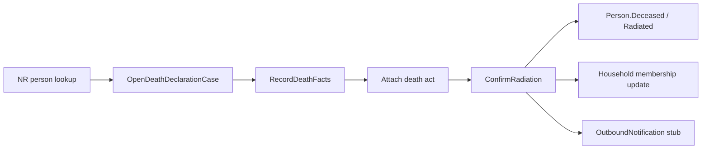

# Phase 20 — Death declaration & radiation

- **Status:** Complete
- **Completed:** July 2026
- **Goal:** Register a death and remove (or mark) the person from the active municipal population register — the lifecycle counterpart to [Phase 12 birth declaration](./phase-12-birth-declaration.md).
- **Maps to IDEA:** Ongoing register maintenance; person-file history.

---

## Summary

A new **`DeathDeclarationCase`** (or **`RadiationCase`**) bounded context handles:

1. Officer opens a case for a registered person (NR lookup).
2. Records death facts (date, place, informant, supporting act).
3. Optionally updates household (remove deceased as member / head).
4. Confirms → person status becomes deceased / radiated; domicile cleared; outbound notification stub (e.g. tax, social security).

Educational simplification: one linear confirmation path — not full funeral-home integrations or multi-commune competence disputes.

---

## Deliverables checklist

| Deliverable | Status | Notes |
|-------------|--------|-------|
| `DeathDeclarationCase` aggregate + checklist | Done | Statuses, death facts, death act, household review |
| `PersonRadiated` domain event | Done | Stub tax administration + social security notifications |
| `Person.MarkDeceased` / `ClearDomicile` | Done | Confirmation stamps death date and clears domicile |
| `Household.RemoveMemberMatching` + repository lookup | Done | Deceased removed from any household on confirm |
| EF migration `Phase20DeathDeclaration` | Done | `death_declaration_cases` + document/notification FKs |
| `IDeathDeclarationCaseRepository` | Done | List, get, active-by-person, add, save |
| API group `/api/death-declarations/*` | Done | All intake + decision slices |
| Claim / release lock | Done | Reuses shared case-locking pattern |
| Web pages `/death-declarations` + detail | Done | List, detail, open dialog (NR search), decision panel |
| Reception routing + nav + review dashboard tiles | Done | `VisitReason.DeathDeclaration`; unassigned / radiations-ready tiles |
| Person file deceased chip + case/history/documents | Done | Deceased status chip; death case on Cases tab; filtered from household display |
| Domain + integration tests | Done | Confirm/guard/dashboard/authorization coverage |

---

## Architecture

**Reuse:** Phase 5 NR search, Phase 8 notification log, Phase 16 person file (history + status badge), case locking pattern from Phase 8.1 / 12.

---

## Slices

| Slice | Notes |
|-------|-------|
| `OpenDeathDeclarationCase` | Requires registered person with active domicile |
| `RecordDeathFacts` | Date, place, informant relationship |
| `AttachDocument` / `RemoveDocument` | Death certificate / act type |
| `ConfirmRadiation` / `RejectCase` | Terminal outcomes |
| `List` / `Get` | Queue + detail |
| Claim / release lock | Same officer UX as other case types |

---

## Domain

- Aggregate with checklist: person linked, death facts, supporting document, household reviewed
- Guard: cannot open if person already deceased
- On confirm: stamp `Person` death date; clear official address; remove from household; audit entry
- Visit reason: `DeathDeclaration` on reception routing

---

## UI

| Page | Route |
|------|-------|
| List | `/death-declarations` |
| Detail | `/death-declarations/{id}` |

- Reception: visit reason → open death case
- Review dashboard tile: unassigned / ready-to-confirm
- Person file: **Deceased** status chip; case appears on Cases tab; no further COA / document request actions

---

## Demo

1. Person lookup → registered resident → reception opens **Death declaration**.
2. Population officer records death date + attaches act → confirms.
3. Person file shows deceased; household composition no longer lists them; notification log has stub entries.

---

## Tests

- Domain: cannot confirm without document; cannot open for already-deceased person
- Integration: confirm updates person + household; review dashboard includes death cases
- Unauthorized reject/confirm by wrong role

---

## Out of scope

- Cross-border death competence (death abroad) beyond a single “abroad” place flag
- Estate / notary workflows
- Automatic spouse civil-status → widowed (optional stretch → Phase 24 coordination)
- FR / NL localization

---

## Dependencies

- Phase 12 pattern for separate life-event aggregate
- Phase 16 person file for status display
- Phase 8 outbound notification log

---

## Related documents

- [phase-12-birth-declaration.md](./phase-12-birth-declaration.md)
- [phase-16-person-file.md](./phase-16-person-file.md)
- [phase-19-life-events-citizen-services.md](./phase-19-life-events-citizen-services.md)
