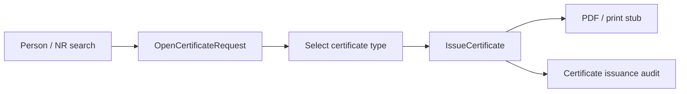

# Phase 21 — Certificate desk (on-demand)

- **Status:** Planned
- **Goal:** Let citizens (via officers) request **residence certificates, household composition, and register extracts** for any registered person — not only as a side-effect of a completed first-registration case.
- **Maps to IDEA:** Phase 23 citizen documents; day-to-day counter work.

---

## Summary

Phase 8 issues certificates from a **closed registration case**. Real municipal desks mostly issue extracts from the **current register state**. This phase adds a lightweight **`CertificateRequest`** workflow (or expands the existing certificate feature) keyed by `PersonId` / NR number.

Educational simplification: printable HTML/PDF stubs already used in Phase 8; no secure citizen portal.

---

## Architecture

**Reuse:** Phase 8 PDF generation, Phase 16 person file as entry point, Phase 5 search UI components (`NationalRegisterSearch` patterns).

---

## Slices

| Slice | Notes |
|-------|-------|
| `OpenCertificateRequest` | Person must be registered (not deceased unless extract-for-history stretch) |
| `IssueResidenceCertificate` | From current domicile |
| `IssueHouseholdComposition` | From current household |
| `IssueNationalRegisterExtract` | Stub identity + address summary |
| `ListCertificateIssuances` | Per person + global recent list for back office |

---

## Domain / application

- Prefer a small aggregate or command log: request type, issued at, officer id, document storage path
- Block issuance when person is deceased (except optional “historical extract” later)
- Reference-address residents: certificate text notes reference domicile (Phase 18)

---

## UI

| Page | Route |
|------|-------|
| Certificate desk | `/certificates` |
| Issuance from person file | Button on person file header |

- Reception visit reason optional: `CertificateRequest` → opens desk with person pre-selected
- Back office: recent issuances list (read-only)

---

## Demo

1. Person lookup → Sofia Nguyen → **Issue household composition**.
2. Download/print PDF; person file History shows issuance; Certificates admin list shows the stub.

---

## Tests

- Cannot issue for unregistered / intake-only person
- Household composition reflects current members after COA
- Integration: issue → storage path + audit entry

---

## Out of scope

- Citizen self-service portal
- Paid fee workflow (optional stub like Phase 14 later)
- Multilingual certificate templates
- FR / NL UI localization

---

## Dependencies

- Phase 8 certificate PDF stubs
- Phase 16 person file
- Phase 13/18 domicile & reference address semantics for correct wording

---

## Related documents

- [phase-8.1-role-boundaries-case-locking.md](./phase-8.1-role-boundaries-case-locking.md) — related officer UX (certificates originally on registration)
- [phase-16-person-file.md](./phase-16-person-file.md)
- [phase-19-life-events-citizen-services.md](./phase-19-life-events-citizen-services.md)
