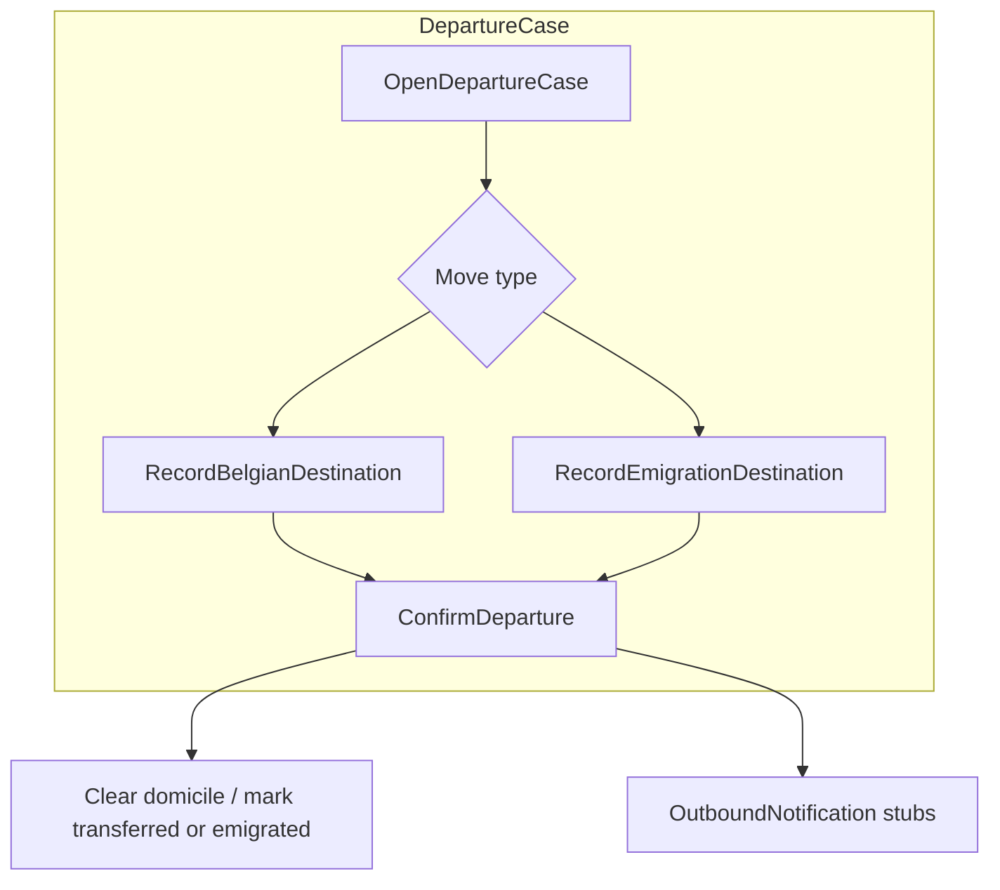

# Phase 22 — Inter-municipal move & emigration

- **Status:** Planned
- **Goal:** Handle residents who **leave Schaerbeek** — move to another Belgian municipality or emigrate abroad — with register radiation / transfer stubs and outbound notifications.
- **Maps to IDEA:** Address lifecycle beyond intra-municipal COA; Phase 13 “out of scope” follow-up.

---

## Summary

[Phase 13](./phase-13-change-of-address.md) covers moves **within** Schaerbeek. This phase adds:

| Path | Behaviour |
|------|-----------|
| **Departure to another commune** | Record destination municipality; clear Schaerbeek domicile; stub “notify destination commune”; person marked transferred |
| **Emigration** | Record foreign destination (country + free-text address); radiate from Belgian municipal register (simplified) |

Educational simplification: no real inter-commune electronic exchange — notification log + person status only. Destination commune is selected from a small seed list (Brussels communes + a few others).

---

## Architecture

**Option A (preferred):** new `DepartureCase` / `ChangeOfMunicipalityCase` aggregate.  
**Option B:** extend `ChangeOfAddressCase` with `MoveScope` (`IntraMunicipal` / `InterMunicipal` / `Emigration`) — only if it stays readable.

---

## Slices

| Slice | Notes |
|-------|-------|
| `OpenDepartureCase` | NR person with current Schaerbeek domicile |
| `RecordBelgianDestination` | Commune code + optional street (free text OK) |
| `RecordEmigrationDestination` | Country + address text |
| `ConfirmDeparture` / `Reject` | Terminal |
| Optional police | Usually **not** required for departure (document why in domain) |
| List / Get / lock | Standard case UX |

---

## Domain

- Visit reasons: `MoveOutOfMunicipality`, `Emigration` (or one reason + type on case)
- Guards: person must be registered; cannot depart if open COA / registration case exists
- On confirm: previous address history entry; domicile null; status `Transferred` or `Emigrated`
- Outbound stubs: destination commune / FPS Interior (log only)

---

## UI

| Page | Route |
|------|-------|
| List | `/departures` or under Change of address with filter |
| Detail | `/departures/{id}` |

- Reception routing for both visit reasons
- Person file: status badge + last known address history

---

## Demo

1. Registered resident → **Move to Ixelles** → confirm → person no longer has Schaerbeek domicile; notification log shows destination stub.
2. Second demo: **Emigrate to France** → person marked emigrated; certificate desk (Phase 21) refuses new residence certificate.

---

## Tests

- Intra-municipal COA still works unchanged (regression)
- Confirm departure clears domicile and blocks new Schaerbeek COA until re-registration
- Emigration path sets distinct status reason

---

## Out of scope

- Arrival **into** Schaerbeek from another commune as a distinct “incoming transfer” aggregate (first registration / COA already cover demos)
- Real Belpic / RN exchange messages
- FR / NL localization

---

## Dependencies

- Phase 13 COA patterns and address history
- Phase 16 person file status display
- Phase 8 notification log
- Optional: Phase 21 certificate desk for “cannot issue after emigration” rule

---

## Related documents

- [phase-13-change-of-address.md](./phase-13-change-of-address.md)
- [phase-18-remaining-exception-scenarios.md](./phase-18-remaining-exception-scenarios.md) — reference address (orthogonal)
- [phase-19-life-events-citizen-services.md](./phase-19-life-events-citizen-services.md)
