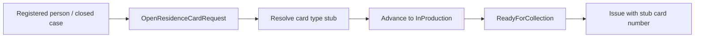

# Phase 23 — Residence card production

- **Status:** Planned
- **Goal:** After (or alongside) successful registration, simulate ordering and collecting a **residence card** (A/B/EU/F/… stub) — IDEA Phase 21, distinct from [Phase 14 passport / eID](./phase-14-passport-id-request.md).
- **Maps to IDEA:** Phase 21 residence card production (PIN/PUK, collection).

---

## Summary

Belgian nationals renew eID/passport via Phase 14. Foreign residents typically receive a **residence card** produced after Immigration / municipal registration steps. This phase adds a **`ResidenceCardRequest`** (or extends document-request with a card category) driven by:

- Register target + residence category / permit type on the linked person or closed `RegistrationCase`
- Linear statuses similar to Phase 14: `Requested` → `InProduction` → `ReadyForCollection` → `Issued` / `Cancelled`
- Stub PIN/PUK delivery note and collection appointment date

Educational simplification: no real card bureau; card type inferred from permit / category with an officer override.

---

## Architecture

**Reuse:** Phase 14 status machine & UI patterns; Phase 2 permit types; Phase 16 person file entry point; photo document type if needed.

---

## Slices

| Slice | Notes |
|-------|-------|
| `OpenResidenceCardRequest` | From person file or post-`ConfirmRegistration` CTA |
| `RecordCardType` / auto-resolve | A/B/EU/F/… enum subset |
| `SubmitForProduction` | Fee stub optional |
| `MarkReadyForCollection` | Collection date |
| `IssueResidenceCard` | Stub number `RC-YYYY-XXXX` |
| `CancelResidenceCardRequest` | Before issued |
| List / Get / lock | Standard |

---

## Domain

- Block for Belgian population-register nationals without foreign residence need (redirect to Phase 14)
- Diplomat / Special Register: optional “no municipal card” info path (document in UI)
- Link optional `SourceRegistrationCaseId` for audit

---

## UI

| Page | Route |
|------|-------|
| Queue | `/residence-cards` |
| Detail | `/residence-cards/{id}` |

- Post-registration success panel: **Order residence card** when category warrants it
- Person file: active/issued cards tab or section

---

## Demo

1. Complete non-EU worker registration (B card permit on case).
2. Open residence card request → production → ready → issue.
3. Person file shows issued residence card stub; PIN/PUK note printable.

---

## Tests

- Cannot open for person without legal residence established / register entry
- Issue requires ReadyForCollection
- Card type suggestion matches NonEuWorker + B card in integration seed

---

## Out of scope

- Real card personalisation bureau / biometrics
- PIN mailer integration
- Overlap merge with Phase 14 into one mega-aggregate (keep products separate unless UX demands a shared shell)
- FR / NL localization

---

## Dependencies

- Phase 7/8 registration complete path
- Phase 14 workflow UX patterns
- Phase 2 residence permit metadata
- Phase 16 person file

---

## Related documents

- [phase-14-passport-id-request.md](./phase-14-passport-id-request.md)
- [phase-7-decision-registration.md](./phase-7-decision-registration.md)
- [phase-19-life-events-citizen-services.md](./phase-19-life-events-citizen-services.md)
- [GLOSSARY.md](../GLOSSARY.md) — residence document letters
