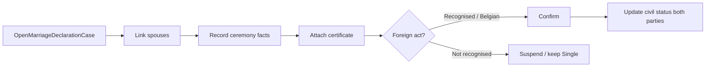

# Phase 24 — Marriage / partnership declaration

- **Status:** Planned
- **Goal:** Dedicated civil-status **life-event** workflow to register a marriage or legal partnership for persons already in the register — beyond recording civil status during first-registration intake.
- **Maps to IDEA:** Civil status maintenance; marriage recognition exception (Phase 9) as a related path.

---

## Summary

Today civil status is an **intake field** on `RegistrationCase` and an **amendment type** on `RegisterAmendmentCase`. Municipalities also process **marriage / partnership declarations** as first-class procedures (often with two parties, celebration date, and document packs).

New aggregate **`MarriageDeclarationCase`** (name flexible: partnership included):

- Link spouse A (required, registered) and spouse B (registered **or** stub foreign spouse pending registration)
- Record ceremony date, place, regime (simplified)
- Attach marriage certificate; foreign act → recognition flag (reuse Phase 9 “not recognised” → keep single until recognised)
- On confirm: update both persons’ civil status; optional household merge stub

Educational simplification: no full matrimonial property regimes; no celebration booking calendar.

---

## Architecture

---

## Slices

| Slice | Notes |
|-------|-------|
| `OpenMarriageDeclarationCase` | At least one Schaerbeek-registered party |
| `LinkSpouse` / `RecordPartnerDetails` | Second party NR link or foreign identity stub |
| `RecordCeremonyDetails` | Date, place, type (marriage / partnership) |
| `SetRecognitionStatus` | For foreign certificates |
| `ConfirmMarriageDeclaration` / `Reject` / `Suspend` | Terminal / pause |
| Documents + lock + list/get | Standard patterns |

---

## Domain

- Visit reason: `MarriageDeclaration` / `PartnershipDeclaration`
- Guards: neither party already married (unless divorce recorded); deceased blocked
- Interaction with Phase 17: prefer this workflow for marriage events; amendments remain for corrections
- Optional stretch: auto-open amendment is **not** desired — this case applies directly

---

## UI

| Page | Route |
|------|-------|
| List | `/marriage-declarations` |
| Detail | `/marriage-declarations/{id}` |

- Reception routing
- Person file: **Declare marriage** action; history event on confirm
- Review dashboard tile when suspended for recognition

---

## Demo

1. Two registered residents → open marriage declaration → attach Belgian certificate → confirm.
2. Both person files show Married + spouse link; household composition option to merge addresses (stub dialog).

Foreign path demo: foreign certificate → **Not recognised** → case suspended; parties remain Single until recognition recorded.

---

## Tests

- Cannot confirm without both parties identified
- Not-recognised path leaves civil status unchanged and suspends case
- Confirm updates both persons; audit on each person file history

---

## Out of scope

- Divorce / dissolution as full procedure (can remain Phase 17 amendment)
- Church vs civil celebration logistics
- Full private international law recognition matrix
- FR / NL localization

---

## Dependencies

- Phase 9 marriage recognition rules
- Phase 16 person file / Phase 17 amendment boundaries
- Phase 4 household model for optional merge

---

## Related documents

- [phase-9-exception-scenarios.md](./phase-9-exception-scenarios.md)
- [phase-17-post-registration-amendments.md](./phase-17-post-registration-amendments.md)
- [phase-19-life-events-citizen-services.md](./phase-19-life-events-citizen-services.md)
