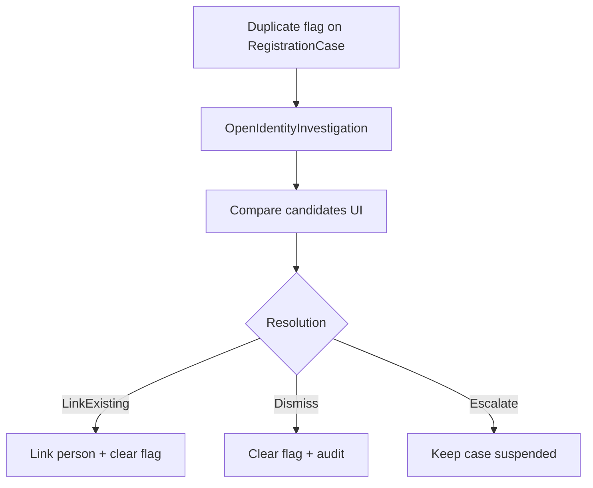

# Phase 25 — Investigation workspace

- **Status:** Planned
- **Goal:** Turn Phase 9 **duplicate identity** (and related) flags into an actionable **investigation queue** with resolve / merge / continue outcomes — instead of a banner-only warning.
- **Maps to IDEA:** Duplicate identity exception; officer investigation.

---

## Summary

Phase 9 can flag duplicate suspicion on a registration case. Officers currently lack a dedicated place to:

- See all open identity investigations
- Compare candidate NR / BIS records side by side
- Resolve: **link existing**, **dismiss false positive**, or **keep blocked** pending supervisor

This phase introduces a lightweight **`IdentityInvestigation`** aggregate (or case subtype) owned by Population officers, with optional Back-office read access.

Educational simplification: no ML matching beyond existing `NationalRegisterSearchScorer`; no real judicial identity tribunal.

---

## Architecture

---

## Slices

| Slice | Notes |
|-------|-------|
| `OpenIdentityInvestigation` | From case banner or auto when duplicate score ≥ threshold |
| `ListOpenInvestigations` | Queue for population officers |
| `GetInvestigation` | Side-by-side person / NR snapshots |
| `ResolveByLinking` | Reuse `LinkExistingPerson` semantics |
| `DismissInvestigation` | Reason required |
| `EscalateInvestigation` | Keeps registration suspended |

---

## Domain

- Link investigation to `RegistrationCaseId` (+ optional competing `PersonId`s)
- Statuses: `Open` → `ResolvedLinked` / `ResolvedDismissed` / `Escalated`
- Registration case remains blocked from approve while investigation `Open` or `Escalated`
- Audit every resolution on both investigation and registration case

---

## UI

| Page | Route |
|------|-------|
| Queue | `/investigations` |
| Detail | `/investigations/{id}` |

- Case detail: banner CTA **Open investigation** / **View investigation**
- Review dashboard: count of open investigations
- Compare layout: two `AppPropertyGrid` columns (design system)

---

## Demo

1. Create identity that fuzzy-matches a seed NR person → duplicate warning.
2. Open investigation → compare → **Link existing** → case identity linked; warning cleared.
3. Alternate: **Dismiss** with reason → approve path unblocked with audit note.

---

## Tests

- Approve blocked while investigation open
- Resolve-by-link updates case person and closes investigation
- Dismiss requires non-empty reason
- List endpoint role-guarded

---

## Out of scope

- Automatic merge of two already-registered persons (high risk; educational note only)
- Biometric / photo face match
- FR / NL localization

---

## Dependencies

- Phase 5 search / link / duplicate warning
- Phase 9 exception evaluator flags
- Phase 7 approve gates
- Phase 16 person file for compare fields

---

## Related documents

- [phase-5-national-register-search-bis.md](./phase-5-national-register-search-bis.md)
- [phase-9-exception-scenarios.md](./phase-9-exception-scenarios.md)
- [phase-19-life-events-citizen-services.md](./phase-19-life-events-citizen-services.md)
