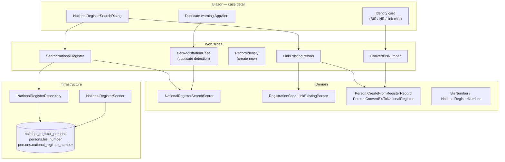

# Phase 5 — National Register search & BIS

- **Status:** Complete
- **Completed:** July 2026
- **Goal:** Duplicate detection and BIS handling before and during identity establishment.
- **Maps to IDEA:** Phases 13 (National Register search) and 14 (BIS vs National Register number)

---

## Summary

Phase 5 introduces a **stubbed National Register** — a read-only reference table of persons who may already exist in Belgian administrative systems (BIS or NR numbers). Before creating a new person file, officers search this register, review scored matches, and either **link** an existing record or **create** a new person. When a linked person has only a BIS number, the officer can **convert** it to a National Register number (simplified stub).

A follow-up enhancement allows **partial search**: any combination of given name, family name, and date of birth — including a single token such as `Marie` or `Dupont` — returns multiple ranked propositions.

---

## Problem this phase solves

In Belgian municipal practice, creating a duplicate person in the registers is a serious error. Before recording identity on a first-registration case, the population officer must check whether the applicant already exists — perhaps from a previous stay, a BIS assignment for social security, or a child registered years ago.

This educational project simulates that check with:

1. A seeded `national_register_persons` table (external to case workflow)
2. Search with confidence scoring
3. Two identity paths: **link existing** vs **create new**
4. Post-hoc duplicate warnings when identity was created without linking
5. BIS → NR conversion for persons who had administrative numbers but not full registration

---

## Architecture



### Identity establishment paths

| Path | When | Handler | Domain method | Person outcome |
|------|------|---------|---------------|----------------|
| **Search + link** | Register match found | `LinkExistingPersonHandler` | `RegistrationCase.LinkExistingPerson` | `Person.CreateFromRegisterRecord` — copies BIS/NR, sets `LinkedRegisterRecordId` |
| **Create new** | No match / officer proceeds anyway | `RecordIdentityHandler` | `RegistrationCase.RecordIdentity` | `Person.Create` — no register link |
| **Convert BIS** | Linked or created person has BIS only | `ConvertBisNumberHandler` | `Person.ConvertBisToNationalRegister` | Assigns stub NR; updates seed record if linked |

All three paths set `Checklist.IdentityEstablished = true` and keep the case in `Intake` status.

---

## Deliverables checklist

| Deliverable | Status | Notes |
|-------------|--------|-------|
| `SearchNationalRegister` slice | Done | Optional criteria; scored results |
| `LinkExistingPerson` slice | Done | Conflict if record or NR already assigned |
| `ConvertBisNumber` slice | Done | Stub NR via `NationalRegisterNumber.GenerateStub` |
| `RecordIdentity` (create new) | Existing | Unchanged; complementary to link path |
| `NationalRegisterPerson` entity | Done | Seed/reference data, not a workflow aggregate |
| `BisNumber` / `NationalRegisterNumber` VOs | Done | 11-digit validation; NR mod97 check |
| `NationalRegisterSearchScorer` | Done | See scoring table below |
| **Partial search** (enhancement) | Done | Any single field or combination |
| `NationalRegisterSearchDialog` | Done | MudDialog with results table + Link per row |
| Duplicate warning banner | Done | When `PossibleDuplicateMatches` non-empty |
| Identity card NR/BIS display | Done | Convert button when BIS-only |
| EF migration `NationalRegisterSearch` | Done | New table + person columns |
| Domain + integration tests | Done | 90 tests in fast suite |
| Feature docs | Done | See [features/registration/](../features/registration/) |

---

## Search scoring

Implemented in `NationalRegisterSearchScorer`. Only matches with score **≥ 40** are returned.

| Score | Label | When |
|-------|-------|------|
| **100** | Exact | Given name + family name + birth date all provided and match exactly |
| **80** | Strong | Birth date matches + name matches or similar (e.g. `Jacques` ↔ `J.`) |
| **50** | Name | Both names provided and match (birth date absent or different) |
| **40** | Partial | Single criterion only — e.g. given name `Marie`, family name `Dupont`, or birth date alone |

### Partial search examples (seed data)

| Query | Matches returned |
|-------|------------------|
| `givenName=Marie` | Marie Leclerc |
| `familyName=Dupont` | Jean Dupont, J. Dupont |
| `givenName=Amélie&familyName=Bernard&birthDate=1992-03-20` | Amélie Bernard (100%) |
| `givenName=Jacques&familyName=Dupont&birthDate=1985-06-12` | J. Dupont (80% — initial variant) |

Validation: at least **one** of `givenName`, `familyName`, or `birthDate` must be provided. All fields are optional individually.

---

## API routes

| Method | Route | Slice | Doc |
|--------|-------|-------|-----|
| `GET` | `/api/registration/national-register/search` | Search | [search-national-register.md](../features/registration/search-national-register.md) |
| `POST` | `/api/registration/cases/{id}/identity/link` | Link existing | [link-existing-person.md](../features/registration/link-existing-person.md) |
| `POST` | `/api/registration/cases/{id}/identity/convert-bis` | Convert BIS | [convert-bis-number.md](../features/registration/convert-bis-number.md) |
| `POST` | `/api/registration/cases/{id}/identity` | Create new person | [record-identity.md](../features/registration/record-identity.md) |

### Search query parameters

All optional; provide at least one:

```
GET /api/registration/national-register/search?givenName=Marie
GET /api/registration/national-register/search?familyName=Dupont
GET /api/registration/national-register/search?givenName=Marie&familyName=Leclerc&birthDate=1975-01-01
```

---

## Domain model changes

### Person (extended)

| Field | Type | Description |
|-------|------|-------------|
| `LinkedRegisterRecordId` | `NationalRegisterPersonId?` | Set when linked from register stub |
| `BisNumber` | `BisNumber?` | Copied from register or assigned later |
| `NationalRegisterNumber` | `NationalRegisterNumber?` | Copied or assigned on conversion |

### NationalRegisterPerson (reference entity)

Read-only seed table representing external register state. Not mutated during normal case flow except when BIS conversion updates the stub record.

### RegistrationCase

New method: `LinkExistingPerson(NationalRegisterPerson)` — parallel to `RecordIdentity`, same guards (Intake status, no existing PersonId).

### Conflict rules

`LinkExistingPersonHandler` rejects linking when:

- The register record is already linked to another `Person` in this system
- The register record's NR number is already assigned to another `Person`

Throws `NationalRegisterConflictException` → HTTP 409.

---

## Seed data (National Register stub)

Stable IDs exported from `NationalRegisterSeeder` for tests and demos:

| ID constant | Name | Birth date | Number | Demo use |
|-------------|------|------------|--------|----------|
| `MarieLeclercId` | Marie Leclerc | 1975-01-01 | BIS 75010112345 | Partial search `Marie`; link + convert BIS |
| `AmelieBernardId` | Amélie Bernard | 1992-03-20 | BIS 72032054321 | Exact match; duplicate warning demo |
| `JeanDupontId` | Jean Dupont | 1985-06-12 | NR (generated) | Second link blocked (NR assigned) |
| `JacquesDupontId` | J. Dupont | 1985-06-12 | BIS 75061298765 | Fuzzy given name with full criteria |
| `SofiaNguyenId` | Sofia Nguyen | 2000-11-08 | NR (generated) | Unrelated control record |

BIS numbers in seed data start with digit `7` (simulation rule). NR numbers use mod97 check digits via `NationalRegisterNumber.GenerateStub`.

---

## UI components

| Component | Location | Role |
|-----------|----------|------|
| `NationalRegisterSearchDialog` | `Features/Registration/Components/` | Search form + results table + Link action |
| Duplicate banner | `RegistrationCaseDetail.razor` | `AppAlert Severity.Warning` when unlinked person has matches ≥ 80 |
| Identity card extensions | `RegistrationCaseDetail.razor` | BIS/NR display, link chip, convert button |

Design-system alignment: [page template §6 Search results](../design-system/06-page-templates.md#6-search-results-phase-5-nr-search).

---

## Demo walkthroughs

### A — Partial search and link (Marie)

1. Open a new case.
2. Click **Search National Register**.
3. Enter only **Marie** in given name → Search.
4. Select **Marie Leclerc** → **Link**.
5. Identity card shows BIS number and **Linked from National Register**.
6. Click **Convert BIS to National Register number**.

### B — Full search (exact)

1. Search with **Amélie Bernard / 1992-03-20** → 100% match → Link.

### C — Duplicate warning (create without link)

1. On a new case, use the identity form (not search) to record **Amélie Bernard / 1992-03-20**.
2. Yellow **Possible duplicate detected** banner appears.
3. Click **Review matches** to open the search dialog.

### D — Multiple propositions (Dupont)

1. Search with family name **Dupont** only.
2. Two rows: Jean Dupont (NR) and J. Dupont (BIS).
3. Link either one; linking Jean twice on two cases fails on the second attempt.

---

## Tests

```bash
dotnet test --configuration Release --filter "Category!=PostgreSQL"
```

Expected: **90 tests passing** (38 domain + 52 integration).

National Register–specific coverage:

| Test | Layer |
|------|-------|
| `NationalRegisterSearchScorerTests` | Exact, partial given name, partial family name (multiple), unrelated |
| `RegistrationCaseNationalRegisterTests` | Link, convert BIS, convert when already NR |
| `SearchNationalRegisterTests` | Partial `Marie`, full Amélie Bernard |
| `LinkExistingPersonTests` | Link Marie, block double Jean Dupont link |

---

## Carries forward

- Phase 6+ case detail: keep search-before-identity pattern for returned residents
- Phase 7 `AssignNationalRegisterNumber`: real assignment on registration confirmation may supersede stub conversion
- Phase 2.1 correction docs note: identity correction after NR link is not yet supported (unlink/re-link deferred)

---

## Related documents

- [ROADMAP.md](../ROADMAP.md) — Phase 5 entry
- [DOMAIN.md](../DOMAIN.md) — National Register stub context
- [GLOSSARY.md](../GLOSSARY.md) — BIS, NR terminology
- [features/registration/README.md](../features/registration/README.md) — slice index + identity workflow
- [search-national-register.md](../features/registration/search-national-register.md)
- [link-existing-person.md](../features/registration/link-existing-person.md)
- [convert-bis-number.md](../features/registration/convert-bis-number.md)
- [phase-4.1-document-preview-case-ux.md](./phase-4.1-document-preview-case-ux.md)
