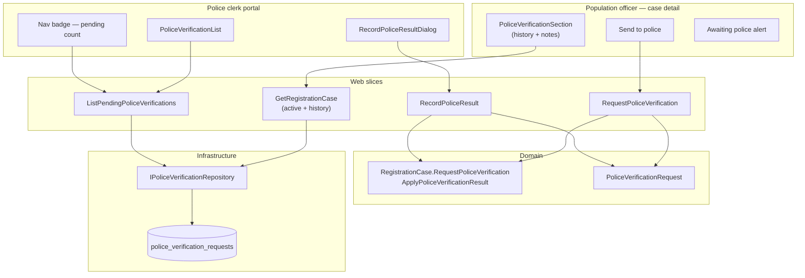

# Phase 6 — Police verification loop

- **Status:** Complete
- **Completed:** July 2026
- **Goal:** Async residence check with separate police role.
- **Maps to IDEA:** Phases 15–17 (request, pending queue, record result)

---

## Summary

Phase 6 introduces the **police verification loop**: after identity and address are recorded, the population officer sends the case to the local police. A **police clerk** records the residence check outcome on a dedicated portal. When the police confirm residence, the case moves to **Under review** with `AddressConfirmed` set on the checklist.

Negative or inconclusive results also return the case to **Under review** without confirming the address, so the officer can correct data and request a second visit (`AttemptNumber` increments).

Completed visits — including outcome and **police clerk notes** — are visible on the case detail page. A single recorded visit uses a summary card; two or more visits use a data table.

---

## Architecture



### Status transitions

| From | Action | To | Checklist |
|------|--------|-----|-----------|
| `Intake` | Request police verification | `AwaitingPoliceVerification` | unchanged |
| `UnderReview` | Re-request after failed/incomplete check | `AwaitingPoliceVerification` | unchanged |
| `AwaitingPoliceVerification` | Record `Confirmed` | `UnderReview` | `AddressConfirmed = true` |
| `AwaitingPoliceVerification` | Record any other result | `UnderReview` | `AddressConfirmed = false` |

Intake edits remain blocked while status is `AwaitingPoliceVerification` (existing `EnsureIntakeDataEditable` guard).

---

## Deliverables checklist

| Deliverable | Status | Notes |
|-------------|--------|-------|
| `RequestPoliceVerification` slice | Done | Requires identity + address declared |
| `ListPendingPoliceVerifications` slice | Done | Police clerk queue |
| `RecordPoliceResult` slice | Done | All outcome enum values + optional notes |
| `PoliceVerificationRequest` aggregate | Done | Attempt number, notes, timing |
| Case status `AwaitingPoliceVerification` | Done | Used in status machine |
| `AddressConfirmed` checklist flag | Done | Set only on `Confirmed` result |
| EF migration `PoliceVerification` | Done | `police_verification_requests` table |
| Case detail — Send to police | Done | Header action + awaiting alert |
| `PoliceVerificationSection` on case detail | Done | Pending card + completed history |
| Adaptive history UI | Done | 1 visit → card; 2+ visits → `AppDataTable` |
| Police clerk portal | Done | `/registration/police-verifications` |
| Nav badge (pending count) | Done | Police clerk role only; isolated DbContext scope |
| Domain + integration tests | Done | 101 tests in fast suite |

---

## API routes

| Method | Route | Slice | Doc |
|--------|-------|-------|-----|
| `POST` | `/api/registration/cases/{id}/police-verification` | Request | [request-police-verification.md](../features/registration/request-police-verification.md) |
| `GET` | `/api/registration/police-verifications/pending` | List pending | [list-pending-police-verifications.md](../features/registration/list-pending-police-verifications.md) |
| `POST` | `/api/registration/police-verifications/{requestId}/result` | Record result | [record-police-result.md](../features/registration/record-police-result.md) |

### Record result body

```json
{
  "result": "Confirmed",
  "officerNotes": "Person present at declared address."
}
```

`result` values: `Confirmed`, `NotFound`, `AddressIncorrect`, `MailboxOnly`, `EmptyDwelling`, `RefusedAccess`, `Incomplete`.

`officerNotes` is optional (max 2000 characters).

---

## Domain model

### PoliceVerificationRequest

| Field | Type | Description |
|-------|------|-------------|
| `Id` | `PoliceVerificationRequestId` | Primary key |
| `RegistrationCaseId` | `RegistrationCaseId` | Parent case |
| `RequestedAt` | `DateTimeOffset` | When population officer sent the case |
| `CompletedAt` | `DateTimeOffset?` | When police clerk recorded result |
| `Result` | `PoliceVerificationResult?` | Outcome enum |
| `OfficerNotes` | `string?` | Free-text comment from police clerk |
| `AttemptNumber` | `int` | 1-based visit counter (supports re-send after incomplete) |

### RegistrationCase (extended)

| Method | When | Effect |
|--------|------|--------|
| `RequestPoliceVerification()` | `Intake` or `UnderReview`; identity + address declared | Status → `AwaitingPoliceVerification` |
| `ApplyPoliceVerificationResult(result)` | `AwaitingPoliceVerification` | Status → `UnderReview`; sets/clears `AddressConfirmed` |
| `HasPositivePoliceVerification` | Read | `Checklist.AddressConfirmed` |

### GetRegistrationCase DTO fields (Phase 6)

| Field | Description |
|-------|-------------|
| `activePoliceVerification` | Pending request for this case, if any |
| `policeVerificationHistory` | Completed visits (newest attempt first) |

Each entry is a `PoliceVerificationDto`: `requestId`, `attemptNumber`, `requestedAt`, `completedAt`, `result`, `officerNotes`, `isPending`.

---

## Police verification outcomes

| Result | Address confirmed? | Typical next step |
|--------|-------------------|-------------------|
| `Confirmed` | Yes | Officer proceeds to decision (Phase 7) |
| `Incomplete` | No | Re-send to police (attempt 2+) |
| `NotFound`, `AddressIncorrect`, … | No | Officer reviews/corrects address |

---

## UI components

| Component | Location | Role |
|-----------|----------|------|
| `PoliceVerificationSection` | `Features/Registration/Components/` | Case detail — pending card + history |
| `RecordPoliceResultDialog` | `Features/Registration/Components/` | Police clerk outcome form |
| `PoliceVerificationList` | `Features/Registration/Pages/` | Pending queue at `/registration/police-verifications` |
| Send to police button | `RegistrationCaseDetail.razor` | Header action when prerequisites met |
| Nav badge | `MainLayout.razor` | Pending count for police clerk role |

### PoliceVerificationSection layout rules

| State | UI |
|-------|-----|
| Pending visit exists | `AppCard` — attempt number, sent date, “Awaiting result” chip |
| **1** completed visit | `AppCard` — outcome chip, requested/recorded dates, notes block |
| **2+** completed visits | `AppDataTable` — Visit, Outcome, Requested, Recorded, Police clerk notes |

Pending and completed visits can appear together (e.g. attempt 1 recorded, attempt 2 pending).

### Blazor DbContext note

`MainLayout` loads the nav pending-count badge in a **separate `IServiceScopeFactory` scope** so it does not run concurrent queries on the same scoped `DbContext` as the page body (Blazor Server).

---

## Demo walkthroughs

### A — Happy path

1. Open a case with identity and Schaerbeek address recorded.
2. Click **Send to police** on case detail → status becomes **Awaiting police**.
3. Switch role to **Police clerk** → open **Police verifications** in nav.
4. Click **Record result** → select **Confirmed** → add optional notes → Save.
5. Return to case → status **Under review**, **Address confirmed ✓** on checklist.
6. **Police verification** section shows the visit card with outcome and notes.

### B — Incomplete → second visit (grid)

1. Police clerk records **Incomplete** with notes.
2. Case returns to **Under review**; section shows one visit card.
3. Population officer clicks **Send to police** again → attempt 2 pending card appears.
4. Police records **Confirmed** on attempt 2.
5. Section switches to **data table** with both visits (newest first).

### C — Negative result

1. Police records **Not found** with comment.
2. Case moves to **Under review** without address confirmation.
3. Officer reviews notes in **Police verification** section, corrects address if needed, re-sends.

---

## Tests

```bash
dotnet test --configuration Release --filter "Category!=PostgreSQL"
```

Expected: **101 tests passing** (44 domain + 57 integration).

Police-specific coverage:

| Test | Layer |
|------|-------|
| `RegistrationCasePoliceVerificationTests` | Domain transitions, prerequisites, double-record |
| `PoliceVerificationTests.RequestPoliceVerification_FullLoop_ConfirmsAddress` | End-to-end happy path |
| `PoliceVerificationTests.RecordPoliceResult_NegativeResult_DoesNotConfirmAddress` | Negative result |
| `PoliceVerificationTests.RequestPoliceVerification_Incomplete_AllowsSecondAttempt` | Attempt 2 |
| `PoliceVerificationTests.RequestPoliceVerification_WhilePending_Throws` | Conflict guard |
| `PoliceVerificationTests.GetRegistrationCase_AfterPoliceResult_ReturnsHistoryWithNotes` | DTO history + notes |

---

## Carries forward

- Phase 7 `ApproveCase` must require `AddressConfirmed` and positive police result
- Phase 2.1: corrections during `AwaitingPoliceVerification` and address invalidation after police result — revisit if needed
- Phase 7 review dashboard: “Awaiting police” KPI links to pending queue

---

## Related documents

- [ROADMAP.md](../ROADMAP.md) — Phase 6 entry
- [DOMAIN.md](../DOMAIN.md) — Police verification aggregate
- [GLOSSARY.md](../GLOSSARY.md) — Outcome terminology
- [features/registration/README.md](../features/registration/README.md) — slice index
- [get-registration-case.md](../features/registration/get-registration-case.md) — DTO fields
- [phase-5-national-register-search-bis.md](./phase-5-national-register-search-bis.md)
