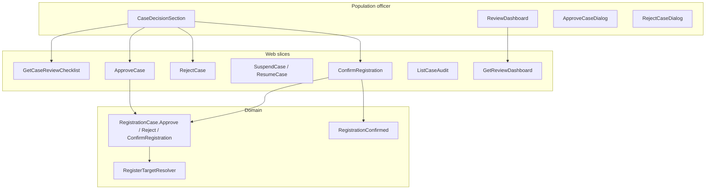

# Phase 7 — Decision & registration

- **Status:** Complete
- **Completed:** July 2026
- **Goal:** Officer decision and official registration in the correct register.
- **Maps to IDEA:** Phases 18–20 (review, approve/reject, confirm registration)

---

## Summary

Phase 7 closes the first-registration loop: after police verification confirms the address, the population officer reviews the **four core questions**, approves or rejects the case, selects a **register target**, and confirms registration. The person receives a stub **National Register number** if they do not already have one. A persistent **case audit trail** records decisions; a **`RegistrationConfirmed`** domain event triggers stub outbound notifications (logged).

---

## Architecture



### Status transitions

| From | Action | To |
|------|--------|-----|
| `UnderReview` | Approve (full checklist + positive police) | `Approved` |
| `UnderReview` | Reject | `Rejected` (terminal) |
| `Intake` / `UnderReview` | Suspend | `Suspended` |
| `Suspended` | Resume | prior status (`Intake` or `UnderReview`) |
| `Approved` | Confirm registration | `Registered` (terminal) |

---

## Deliverables checklist

| Deliverable | Status | Notes |
|-------------|--------|-------|
| `RegisterTarget` enum | Done | Population / Foreigners / Waiting / Special |
| `RegisterTargetResolver` | Done | Category + nationality → suggested register |
| `ApproveCase` / `RejectCase` / `SuspendCase` / `ResumeCase` | Done | Officer auth via `ICurrentOfficer` |
| `ConfirmRegistration` + NR assignment | Done | Stub NR when missing |
| `GetCaseReviewChecklist` | Done | Four core questions + blockers |
| `GetReviewDashboard` | Done | KPI tiles + actionable queue |
| `CaseAuditEntry` + `ListCaseAudit` | Done | Persistent audit table |
| `RegistrationConfirmed` event | Done | Logging handler (Phase 8 → notification log) |
| EF migration `DecisionAndRegistration` | Done | Case decision fields + `case_audit_entries` |
| `AppStatisticCard`, `AppQuickActions`, `AppTimeline` | Done | Design-system Wave 2 components |
| Review dashboard page | Done | `/registration/review-dashboard` |
| `CaseDecisionSection` on case detail | Done | Checklist + approve/reject/suspend/confirm |
| Domain + integration tests | Done | **122 tests** in fast suite |

---

## API routes

| Method | Route | Slice |
|--------|-------|-------|
| `GET` | `/api/registration/cases/{id}/review-checklist` | GetCaseReviewChecklist |
| `POST` | `/api/registration/cases/{id}/approve` | ApproveCase |
| `POST` | `/api/registration/cases/{id}/reject` | RejectCase |
| `POST` | `/api/registration/cases/{id}/suspend` | SuspendCase |
| `POST` | `/api/registration/cases/{id}/resume` | ResumeCase |
| `POST` | `/api/registration/cases/{id}/confirm-registration` | ConfirmRegistration |
| `GET` | `/api/registration/cases/{id}/audit` | ListCaseAudit |
| `GET` | `/api/registration/review-dashboard` | GetReviewDashboard |

### Approve body

```json
{ "registerTarget": "PopulationRegister" }
```

### Reject body

```json
{ "reason": "AddressNotGenuine", "notes": "Police could not confirm residence." }
```

---

## Register target rules (educational)

| Residence category | Nationality | Suggested register |
|--------------------|-------------|-------------------|
| `EuCitizen` | Belgian | `PopulationRegister` |
| `EuCitizen` | Other EU | `ForeignersRegister` |
| `NonEuWorker` | Any | `ForeignersRegister` |
| `Student` | Any | `ForeignersRegister` |

Officer must select the suggested target (strict policy for learning).

---

## Demo walkthroughs

### A — EU Belgian happy path

1. Complete intake through positive police verification (Phase 6 demo).
2. Open case detail → **Officer decision** panel shows four green checks.
3. Click **Approve** → select **Population register** → Save.
4. Click **Confirm registration** → case becomes **Registered**, NR assigned.
5. **Case history** timeline shows approve + confirm entries.

### B — Rejection

1. Case at **Under review** after negative or incomplete police result.
2. **Approve** disabled; click **Reject** → reason + notes.
3. Case **Rejected**; audit trail preserved.

### C — Review dashboard

1. Nav → **Review dashboard**.
2. KPI tiles: open cases, awaiting police, ready for decision (yellow accent), suspended.
3. **Needs my attention** table links to actionable cases.

---

## Tests

```bash
dotnet test --configuration Release --filter "Category!=PostgreSQL"
```

Expected: **122 tests passing** (55 domain + 67 integration).

Phase 7 coverage:

| Test | Layer |
|------|-------|
| `RegistrationCaseDecisionTests` | Approve/reject/suspend/confirm invariants |
| `RegisterTargetResolverTests` | Register suggestion matrix |
| `CaseDecisionTests.FullHappyPath_OpenToRegistered` | End-to-end registration |
| `CaseDecisionTests.RejectCase_PreservesAuditTrail` | Audit persistence |
| `CaseDecisionTests.Approve_WhenPoliceNegative_Throws` | Police gate on approve |

---

## Carries forward

- Phase 8: `IssueResidenceCertificate`, `ListOutboundNotifications` (replace logging handler)
- Phase 9: exception scenarios hook into reject/suspend reasons
- Phase 11: person file read model uses register target + NR from confirmed cases

---

## Related documents

- [ROADMAP.md](../ROADMAP.md) — Phase 7 entry
- [DOMAIN.md](../DOMAIN.md) — four core decisions
- [phase-6-police-verification-loop.md](./phase-6-police-verification-loop.md)
