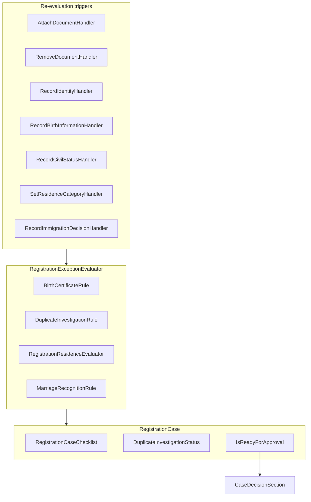

# Phase 9 — Exception scenarios

- **Status:** Complete (high + medium slices)
- **Completed:** July 2026
- **Goal:** Turn manual officer enum selection into domain-driven exception detection — checklist blockers, guided UI alerts, and suggested suspend/reject paths.
- **Maps to IDEA:** Major exception workflows (missing documents, duplicate identity, immigration edge cases)

---

## Summary

Phase 9 extends the Phase 7 decision state machine with **rule-driven exception handling**. A cross-cutting `RegistrationExceptionEvaluator` re-evaluates residence policies, birth evidence, duplicate investigations, marriage recognition, and illegal-stay detection whenever intake data or documents change. The review checklist grows from four to six core questions; the case decision panel surfaces blocking reasons and pre-filled suspend/reject suggestions.

**In scope:** missing birth certificate, duplicate investigation, EU/non-EU policy deepening, refugee/temporary protection, illegal stay referral, marriage not recognised.

**Deferred:** diplomat rules, homeless reference address (low priority).

---

## Architecture



Handlers pass **pending entity overrides** (unsaved documents or permits) so evaluation sees the in-flight mutation before `SaveChanges`.

---

## Deliverables checklist

| Deliverable | Status | Notes |
|-------------|--------|-------|
| `RegistrationCaseChecklist` extensions | Done | `BirthEvidenceEstablished`, `DuplicateInvestigationResolved` |
| `DuplicateInvestigationStatus` enum | Done | `None`, `Open`, `ResolvedLinked`, `ResolvedDistinct` |
| `RegistrationExceptionRules` (domain) | Done | Birth, duplicate, marriage, illegal-stay helpers |
| `RegistrationExceptionEvaluator` | Done | Wired into attach/remove/identity/residence/civil-status handlers |
| `RegistrationExceptionStateCalculator` | Done | Read-side readiness for checklist API |
| `RecordBirthInformation` slice | Done | Handler, validator, endpoint, `BirthInformationStep` UI |
| `ResolveDuplicateInvestigation` slice | Done | Confirm distinct person after NR match |
| Deepened residence policies | Done | EU/non-EU/student identity doc checks; new `RefugeePolicy` |
| `ResidenceCategory.Refugee` | Done | `WaitingRegister` when federal decision present |
| `MarriageRecognitionStatus` on civil status | Done | Pending → effective single for register; blocks approval |
| `IllegalStayDetected` derived flag | Done | Non-EU, no permit, no decision → reject referral |
| EF migration `Phase9ExceptionScenarios` | Done | Checklist columns + duplicate status |
| Extended review checklist (6 questions) | Done | Birth evidence, duplicate investigation |
| UI alerts in intake + decision panels | Done | `AppAlert` warnings/errors with suspend/reject CTAs |
| Domain + integration tests | Done | **150 tests** in fast suite (`Category!=PostgreSQL`) |

---

## Slice summary

### 9.0 — Foundation

- Extended checklist and `IsReadyForApproval` gate.
- `RegistrationExceptionEvaluator` orchestrates residence + exception rules.
- Re-evaluation on document attach/remove (critical fix from Phase 2 gap).

### 9.1 — Missing birth certificate

- `Person.BirthPlace` / `BirthCountry`; `RecordBirthInformation()` on case.
- Rule: birth evidence established when place recorded **and** `BirthCertificate` attached.
- UI warning → suspend with `MissingDocuments` pre-selected.

### 9.2 — EU vs non-EU policy deepen

- `EuCitizenPolicy`: requires passport or national ID card.
- `NonEuWorkerPolicy` / `StudentPolicy`: identity document + valid permit.
- `ResidenceStep` shows policy-specific messages.

### 9.3 — Duplicate identity investigation

- NR match score ≥ 80 → `DuplicateInvestigationStatus.Open`; blocks `Approve()`.
- Link existing person → `ResolvedLinked`; officer confirm distinct → `ResolvedDistinct`.

### 9.4 — Refugee / temporary protection

- `RefugeePolicy`: valid when `ImmigrationDecisionReference` present.
- `RegisterTargetResolver`: refugee + decision → `WaitingRegister`.
- Missing decision → suspend suggestion `AwaitingFederalDecision`.

### 9.5 — Illegal stay

- Derived `IllegalStayDetected` when category set, policy invalid, no permit, no immigration decision.
- Decision panel error alert → reject with `IllegalStay` pre-filled.

### 9.6 — Marriage not recognised

- `MarriageRecognitionStatus`: `NotApplicable`, `Recognised`, `PendingRecognition`.
- Foreign marriage (outside Belgium) → officer must set recognition status.
- `PendingRecognition` → effective register status treated as single; blocks approval.

---

## API routes (new)

| Method | Route | Slice |
|--------|-------|-------|
| `POST` | `/api/registration/cases/{id}/birth-information` | RecordBirthInformation |
| `POST` | `/api/registration/cases/{id}/duplicate-investigation/resolve` | ResolveDuplicateInvestigation |

### Record birth information body

```json
{ "birthPlace": "Ghent", "birthCountry": "Belgium" }
```

### Resolve duplicate investigation body

```json
{ "notes": "Confirmed distinct after review." }
```

---

## Demo walkthroughs

### A — Missing birth certificate

1. Record identity → record birth place (no certificate).
2. Review checklist shows birth evidence **incomplete**; warning in birth section.
3. Suspend with `MissingDocuments` → attach birth certificate → resume.
4. Checklist green → approve when other gates pass.

### B — Duplicate identity

1. Record identity matching seeded NR entry (score ≥ 80).
2. Case shows **open investigation** with link / confirm-distinct actions.
3. Approve disabled until resolved.
4. Confirm distinct (or link existing) → investigation resolved → approve enabled.

### C — EU citizen without passport

1. Set residence category EU → legal residence fails (no identity document).
2. Attach passport → legal residence established.

### D — Refugee awaiting federal decision

1. Select refugee category without immigration decision.
2. Checklist blocks register determinability; suspend suggested.
3. Record federal decision → `WaitingRegister` suggested on approve.

### E — Illegal stay

1. Non-EU worker, no valid permit, no immigration decision.
2. Decision panel shows referral alert.
3. Reject with `IllegalStay` reason.

### F — Marriage abroad pending recognition

1. Record civil status married abroad (e.g. Morocco).
2. Set recognition to pending → effective status single for register.
3. Suspend with `MarriageRecognitionPending` → mark recognised → proceed.

---

## Tests

| Area | File |
|------|------|
| Domain exception rules | `RegistrationExceptionRulesTests` |
| Decision gates (duplicate, marriage) | `RegistrationCaseDecisionTests` |
| Residence policies | `ResidencePolicyTests` |
| Register target (refugee) | `RegisterTargetResolverTests` |
| Integration scenarios | `Phase9ExceptionScenarioTests` |
| Updated happy paths | `CaseDecisionTests`, `NationalRegisterTests`, `ResidenceCategoryTests` |

Run: `dotnet test --configuration Release --filter "Category!=PostgreSQL"`

---

## Carries forward

- **Phase 10:** PostgreSQL validation under Aspire; full integration suite against PG.
- **Deferred slices:** diplomat `SpecialRegister` rules; homeless reference address + shelter police flow.
- No new persisted entities (`InvestigationCase`, `ReferralRecord`) — notes, audit, and enum flags suffice for the educational demo.
